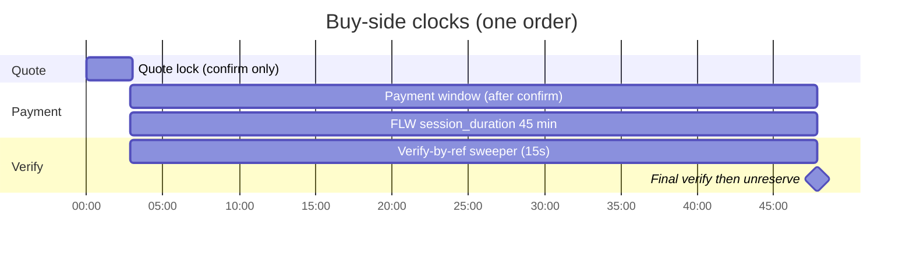
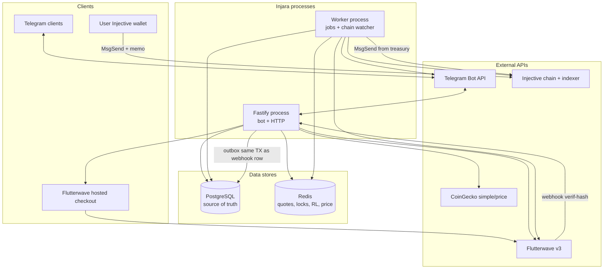
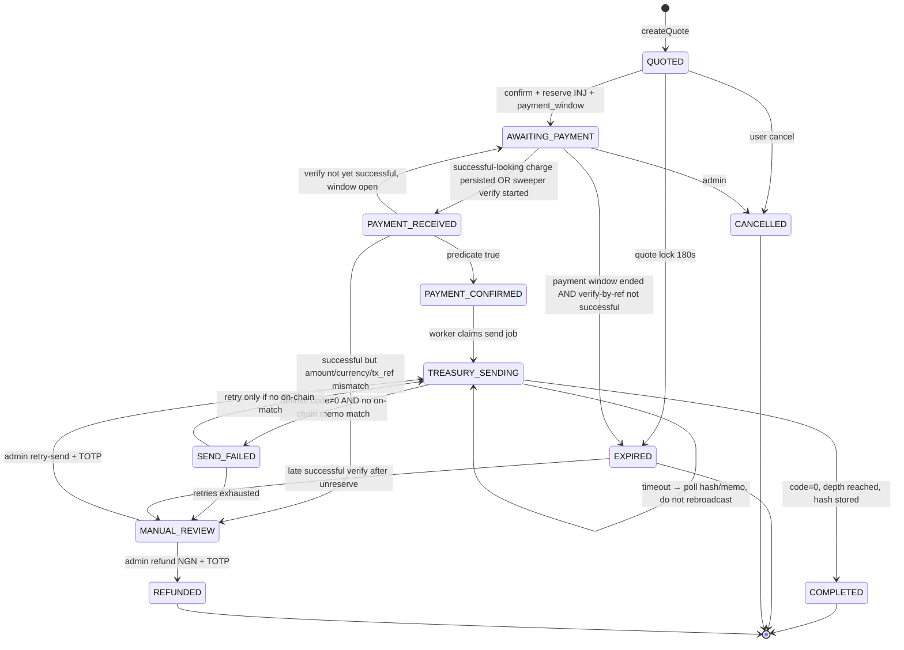
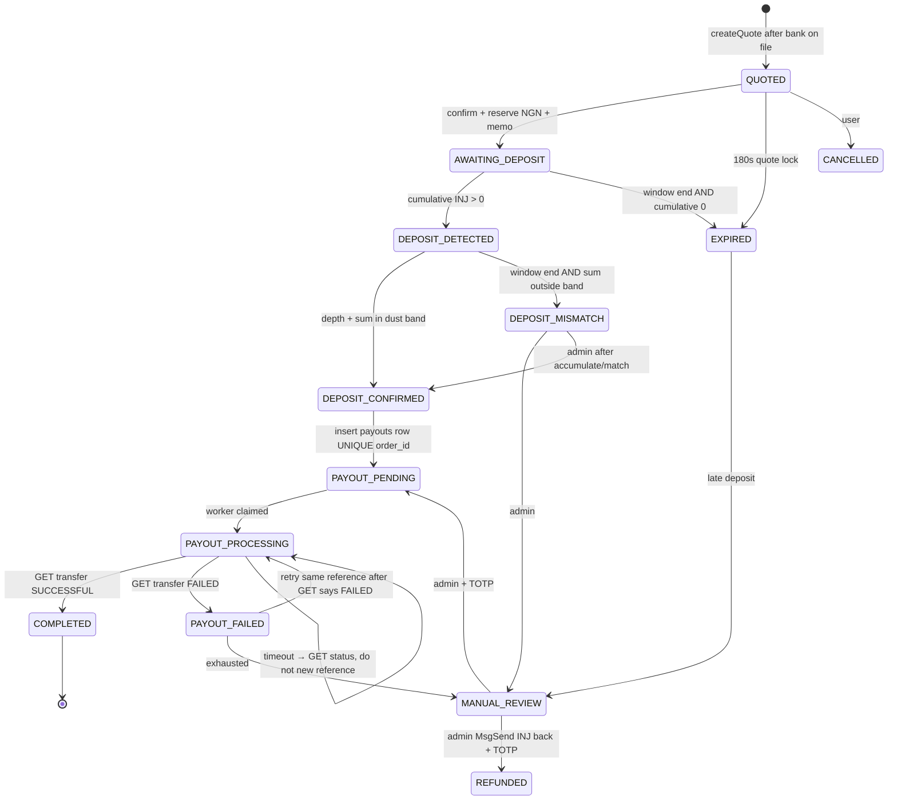

# Injara — Telegram P2P Exchange Bot for Injective (INJ / NGN)

| Field | Value |
|---|---|
| **Document** | System Design — MVP through Production |
| **Author** | TBD (engineering) |
| **Date** | 2026-09-20 |
| **Revised** | 2026-09-20 (review round 2) |
| **Status** | Draft |
| **Audience** | Senior engineers implementing Injara from a greenfield repo |
| **Workspace** | `/workspaces/injara` (currently README-only + this spec + WORK.md) |
| **Canonical path** | `docs/design.md` (copy also under `/tmp/grok-codespace/` for review) |

---

## Overview

Injara is a Telegram bot that lets Nigerian users buy INJ with NGN and sell INJ for NGN. The MVP is a **custodial treasury (hot wallet)** exchange — not a smart-contract escrow. Users never trade with each other on-chain. The platform quotes a locked INJ/NGN price from CoinGecko, collects NGN via Flutterwave Standard hosted checkout, pays NGN via Flutterwave Transfers, and moves INJ with Cosmos `MsgSend` from/to a single treasury address.

The system is a single Node.js + TypeScript application with two process roles (HTTP+bot, worker), PostgreSQL as source of truth, Redis for quotes/locks/rate-limits/price cache, Prisma ORM, Fastify, and grammY.

Money movement is driven by **split settlement clocks**, explicit order state machines, a double-entry ledger with one sign convention, idempotent webhooks whose insert+outbox commit together, two-phase treasury broadcasts that **poll before they resend**, one payout row per sell order, and reservation locks so the hot wallet cannot oversell INJ and the Flutterwave wallet cannot oversell NGN.

This document is the implementation spec. An engineer should be able to build the MVP from it. `WORK.md` is operational status, not a substitute for this file.

---

## Background & Motivation

Nigerian users who want INJ today bounce between CEXes (KYC friction, withdrawal delays) and informal OTC (counterparty risk, no audit trail). Injara meets them in Telegram and settles against Naira rails they already use (Flutterwave: card, bank transfer, USSD).

Current state of the repo: a one-line README plus this design and `WORK.md`. There is no application code. The first implementation must encode production constraints from day one:

- **Real money.** Duplicate Flutterwave webhooks, retried payouts, or a second `MsgSend` for the same order are catastrophic.
- **Single hot wallet.** All buy-side INJ leaves one address; all sell-side INJ arrives at one address. Sell deposits cannot be identified by amount alone.
- **Quote lock ≠ payment window.** INJ is volatile (180s price lock). Nigerian bank transfer / USSD is **not** instant (multi-tens of minutes). Flutterwave retries webhooks 3× at 30-minute intervals. Those are three different clocks.
- **Asynchronous confirmation.** Webhooks and on-chain deposits arrive after the Telegram conversation has ended. Notifications go to stored `telegram_id`.
- **Regulatory exposure.** Crypto-fiat conversion in Nigeria may require SEC/CBN registration. Engineering ships a kill switch; legal is out of band.

---

## Goals & Non-Goals

### Goals (MVP)

1. Buy INJ with NGN via Telegram: 180s locked quote, Flutterwave hosted checkout with a **45-minute payment window** (card + bank transfer + USSD), webhook **and** verify-by-`tx_ref` sweeper, automatic `MsgSend` from treasury.
2. Sell INJ for NGN via Telegram: 180s locked quote, bank name-enquiry **before** the quote lock is consumed, memo-correlated deposit **accumulation**, confirmation depth, Flutterwave payout with **one frozen reference per order**.
3. Real-time INJ/NGN pricing from CoinGecko (`injective-protocol`, `vs_currencies=ngn,usd`).
4. Complete transaction history per user, admin views, append-only audit + balanced ledger.
5. Treasury insolvency protection: refuse buys when `available INJ < reserved + requested + gas buffer`; refuse sells when `available NGN < reserved + payout + FLW fee`.
6. Idempotent webhook and payout processing; no double send; no double payout.
7. Docker Compose **local** stack: Postgres, Redis, app, worker.
8. Living `WORK.md` at repo root, updated after every completed task.
9. Specified refund path (Flutterwave refund for captured NGN; `MsgSend` return for captured INJ) with admin TOTP on mainnet.
10. CI from PR-01; money-path race tests as acceptance criteria of the rails PRs.

### Non-Goals (MVP)

- On-chain smart-contract escrow or atomic swap.
- Peer-to-peer matching (platform-inventory OTC, not an order book).
- Multi-asset support (USDT, USDC, etc.).
- Non-Nigerian fiat, non-Telegram clients, or a public web trading app.
- Full KYC/BVN/NIN (email + INJ address + bank account only). **No-KYC daily cap is ₦100,000** (not millions).
- Unique HD deposit addresses as the default (Phase 2 / kill-switch if unmatched rate > 5%).
- Custodial user balances / “Injara wallet” (users always receive INJ at their own `inj1…`).
- Market-making, inventory hedging, or CEX connectivity.
- Mobile apps, admin SPA, or public REST trading API.
- Automatic INJ return on payout failure without admin action (INJ stays reserved/held; runbook applies).
- Treating Flutterwave `verif-hash` as a payload MAC (it is a static shared secret; GET-verify is the control).

---

## Key Decisions

| # | Decision | Rationale |
|---|---|---|
| K1 | **Fastify**, not Express | JSON Schema validation, raw-body hooks (needed if/when v4 HMAC is enabled), native TypeScript types, grammY `'fastify'` adapter, lower p95 for webhook persist+outbox. |
| K2 | **grammY + `@grammyjs/conversations` v2**, not Telegraf or `grammy-scenes` | Official stack, Fastify webhook adapter, Redis sessions, linear wizards map to `conversation.waitFor`. |
| K3 | **Dev: long polling. Prod: Telegram webhook on the same Fastify instance**, route module `src/http/routes/telegram.ts` only. | Fastest local loop. Production needs push + `secret_token`. Same process is enough at 100–1,000 DAU / 10 concurrent checkouts. |
| K4 | **Separate worker process** | Chain sends, deposit polling, payout retries, quote/payment expiry, verify-by-ref, and price refresh must not share the Fastify event loop. |
| K5 | **Memo-correlated deposits on ONE treasury address (MVP), accumulate-by-memo** | Mandated single hot wallet. Cosmos `TxBody.memo` is first-class. HD unique addresses require sweeping and extra keys. Forgotten memos are unmatched + admin match. **Kill-switch to HD if unmatched rate > 5% of sells over 24h.** |
| K6 | **`MsgSend` (bank module), not `MsgDeposit` / not “MsgBankSend”** | `MsgSend` moves bank balances. `MsgDeposit` is the exchange subaccount primitive. There is no `MsgBankSend`. |
| K7 | **CoinGecko direct INJ/NGN** | `GET /api/v3/simple/price?ids=injective-protocol&vs_currencies=ngn,usd&include_last_updated_at=true`. Snapshot both NGN and USD on the quote. Demo/public cache is ~60s → `PRICE_MAX_AGE_SEC=120`. |
| K8 | **Flutterwave v3 Standard + v3 Transfers** | `POST https://api.flutterwave.com/v3/payments` with `configurations.session_duration` in **minutes**. Payouts `POST /v3/transfers`. Webhook header `verif-hash` is a **static shared secret, not HMAC**. Always re-verify via GET-by-id and GET-by-`tx_ref` before giving value. |
| K9 | **Double-entry ledger from day 1** | Unsigned `amount_base` + `direction` (`debit`\|`credit`). Never signed amounts. `assertBalanced` per `bookTxId` per asset. Periodic recon vs on-chain and FLW wallet. |
| K10 | **INJ as integer base-unit numeric strings; NGN as integer kobo; `decimal.js` for the one multiply** | `1 INJ = 10^18 inj` overflows PostgreSQL `BIGINT` at 50 INJ — **do not store INJ as `BigInt`**. `1 NGN = 100 kobo`. Never IEEE-754 `number` for money. |
| K11 | **Serialize treasury `MsgSend` through a single-concurrency queue; lock held only around broadcast, not confirmation wait** | One hot wallet ⇒ one account sequence. Confirmation wait is async. |
| K12 | **Admin = Telegram user-id allowlist in `ADMIN_TELEGRAM_IDS`** | No public admin menu. Usernames are not identity. |
| K13 | **Pin `@injectivelabs/sdk-ts@1.20.34` exactly. CI denylist `1.20.21` and all `<1.20.23`.** | July 2026: `1.20.21` exfiltrated secrets from **both** `PrivateKey.fromMnemonic` and `PrivateKey.fromHex`. Clean fix `1.20.23`. `fromHex` is not safer on a compromised build. Lockfile + hash. |
| K14 | **Single TypeScript app, not a packages monorepo** | One team, one deployable. |
| K15 | **Platform fee 200 bps each side, env-configurable, taken in NGN** | Covers FLW collection/payout fees + spread. |
| K16 | **Confirmation depth = 2 blocks MVP (testnet), 5 on mainnet** | Injective ~0.6–1s blocks. |
| K17 | **WORK.md is operational status, not this design** | Spec lives at `docs/design.md`. |
| K18 | **Three clocks: quote lock 180s, payment window 45 min + pending grace, webhook/verify window = payment window.** | See [Settlement clocks](#settlement-clocks). Bank/USSD/card allowed via `payment_options`. At window end, **pending/processing extends** `payment_window_ends_at` by `PENDING_GRACE_SEC` (cap 2). Expire only on terminal failed/cancelled or grace cap. Inventory/FX risk is accepted and priced into 200 bps; halt if CoinGecko moves >5% vs snapshot (worker, does not unreserve). |
| K19 | **Failed-attempt `charge.completed` (status ≠ `successful`) is a non-event for the order machine.** | FLW sends these while checkout stays open. They must not go to `PAYMENT_FAILED`. |
| K20 | **Fulfill using `data.amount` (requested), never `charged_amount`.** Auto-fulfill iff `toKobo(data.amount) === order.ngn_amount_kobo`. Mismatch → `MANUAL_REVIEW`. |
| K21 | **One payout row per order (`UNIQUE order_id`). Freeze `flutterwave_reference` at insert. Never mint a second reference.** | v3 duplicate protection is the `reference` field (HTTP 400), not v4 `X-Idempotency-Key`. |
| K22 | **Unknown broadcast / unknown transfer = poll, do not resend.** | Persist `TxClient.hash(txRaw)` before broadcast. Search-by-memo before every send. `GET /v3/transfers` by id/reference before any payout retry. |
| K23 | **NGN reservation at `AWAITING_DEPOSIT`.** Peek at quote-create time; refuse if available − reserved < payout + fee. Available NGN = `FLW_NGN_BALANCE_KOBO` env if set, else last successful `/v3/balances` (fresh < 5 min). **Never treat a missing balances API as 0.** Unknown inventory → refuse the sell. |
| K24 | **Sell wizard collects bank details before creating the locked quote.** | Name-enquiry must not consume the 180s price lock. Deviation from the original product bullet order; documented here. |
| K25 | **Accumulate-by-memo only while `AWAITING_DEPOSIT` or `DEPOSIT_DETECTED` and `now < deposit_window_ends_at`.** | Top-ups with the same memo add to `deposit_inj_base`. Auto `DEPOSIT_CONFIRMED` + payout **only** in those two statuses and inside the window. `EXPIRED` / `DEPOSIT_MISMATCH` further txs → `unmatched_deposits` + page. Admin `/match` is the only path from those states to `DEPOSIT_CONFIRMED`. |
| K26 | **No-KYC caps: ₦100,000 per user per UTC day; ₦100,000 per order; lifetime ₦500,000 then halt that user pending KYC.** | ₦20m/day with no KYC is not a launch posture. |
| K27 | **Mainnet money admin commands require TOTP (`REQUIRE_ADMIN_2FA=true` forced when `INJECTIVE_NETWORK=mainnet` or `FLW_ENV=live`).** | `/refund`, `/retry-send`, `/retry-payout`, `/match` move money. |
| K28 | **Collect a real email before first checkout.** | Flutterwave requires `customer.email`. Do not use `.invalid`. Persist on `User.email`. |
| K29 | **CI in PR-01. Race tests are AC of PR-10/12/15. `docs/design.md` ships in PR-01. Reservation (PR-09) before `PAYMENT_CONFIRMED` exists.** | Do not merge rails without tests that would have caught Issues 1–4. |
| K30 | **Refund is in-scope for MVP, admin-initiated only.** | Captured NGN → Flutterwave `POST /v3/refunds`. Captured INJ → `MsgSend` back to `order.inj_address`. Automatic refunds are a non-goal. |
| K31 | **INJ string math is application-side only.** | `addBase` / `subBase` / `cmpBase` in `money.ts` on JS `bigint` parsed from `/^\d+$/` strings. PostgreSQL must never `+` two INJ text columns. Never `::BIGINT` (overflow at 50 INJ). |
| K32 | **Deposit credit and `processed_chain_txs` share one Postgres transaction.** | Do not mark a tx processed until the matching `deposit_inj_base` increment **or** `unmatched_deposits` + ledger row has committed. |
| K33 | **Failed inclusion nulls `broadcast_tx_hash` in the same CAS to `SEND_FAILED`.** Unknown poll expires to `MANUAL_REVIEW` after `UNKNOWN_POLL_SEC`; never rebuild a send that is merely unknown. |
| K34 | **Buy-gas posting is required on every successful send.** | `gas = onchain_delta - sent_amount` (or simulate `gasUsed`). Recon will page if omitted. |
| K35 | **Buy confirm compensating transaction:** if `POST /v3/payments` fails after reserve, CAS back to `QUOTED` (quote still valid) or `CANCELLED`, unreserve, tell the user. FLW timeout → `verify_by_reference` before any new `tx_ref`. |
| K36 | **Webhook P2002 is success, not 500.** | Unique fingerprint conflict → lock row → `ensureOutbox` → 200. |

---

## Settlement clocks

These clocks are independent. Do not store a single `expires_at` and use it for all three.



| Clock | Duration | Starts | Ends when | Sweeper action while open | Action at end |
|---|---|---|---|---|---|
| **Quote lock** | `QUOTE_TTL_SEC=180` | `quoted_at` | Confirm **or** `quote_expires_at` | `QUOTED` past `quote_expires_at` → `EXPIRED`. **No reservation exists yet** (buy reservation is created at confirm). | User must tap Buy again. |
| **Payment window** | `PAYMENT_WINDOW_SEC=2700` (45 min) + up to `MAX_PAYMENT_WINDOW_EXTENSIONS=2` × `PENDING_GRACE_SEC=1800` | Confirm (`AWAITING_PAYMENT`) | `payment_window_ends_at` (may be extended) | Do **not** unreserve. Do **not** disable the payment link. Ignore failed-attempt charges. Poll verify-by-`tx_ref` every 15s. | See [Payment-window sweeper](#payment-window-sweeper-every-15s). Successful → fulfill. `pending`/`processing` → extend (if cap remains). Terminal `failed`/`cancelled` or grace cap exhausted without success → `EXPIRED`, **then** unreserve, **then** disable link. |
| **Deposit window** (sell) | `DEPOSIT_WINDOW_SEC=900` | Memo issued (`AWAITING_DEPOSIT`) | `deposit_window_ends_at` | Auto-accumulate only while status ∈ `{AWAITING_DEPOSIT, DEPOSIT_DETECTED}` **and** `now < deposit_window_ends_at`. | If sum still outside dust band → `EXPIRED` (zero INJ, **release NGN**) or `DEPOSIT_MISMATCH` (partial, **keep NGN**). After this, further txs are `unmatched_deposits`; **never** auto-payout. Admin `/match` only. |
| **FLW webhook retries** | 3 attempts, 30 min apart (~90 min) | First webhook | n/a | Persist+outbox every delivery. Fulfillment is keyed on `tx_ref` + GET-verify, not on “we already 200’d this body.” | Covered **inside** the 45 min payment window for the first delivery; late retries after expire still hit the handler. If order `EXPIRED` and verify-by-ref is now successful → `MANUAL_REVIEW` (do not auto-send; reservation was released). Page on-call. |

**Never unreserve INJ until:** `now >= payment_window_ends_at` **AND** the last `verify_by_reference(tx_ref)` is **terminal** (`failed` / `cancelled` / missing) **or** grace extensions are exhausted without `isSuccessfulCharge`. A `pending`/`processing` verify **must not** unreserve.

**On confirm (buy):** set `payment_window_ends_at = now() + PAYMENT_WINDOW_SEC`. Do **not** reuse `quote_expires_at`. Create INJ reservation in the same transaction.

**Flutterwave session:** `configurations.session_duration = 45` (minutes), `configurations.max_retry_attempt = 5`. Nested under `configurations`, **not** top-level. Align with `PAYMENT_WINDOW_SEC`.

**Inventory / FX risk of 45 minutes:** INJ can move more than the 200 bps fee. Worker `price-band` (non-blocking for in-flight orders) pages admin if live CoinGecko vs snapshot deviates >5%. Ops may halt new quotes (`BUY_ENABLED=false`). In-flight reservations stay until the payment window algorithm says otherwise. This is accepted for MVP so bank transfer / USSD remain available (`payment_options: "card,banktransfer,ussd,account"`). The alternative (card-only + 3-minute session) is recorded under Alternatives.

---

## System Architecture

### Components



### Process roles

| Process | Binary | Responsibilities | Concurrency notes |
|---|---|---|---|
| **app** | `src/index.ts` `PROCESS_ROLE=app` | Fastify: health, Flutterwave webhook, payment redirect, Telegram webhook. grammY bot (polling in development). Quote creation, order writes, payment-link creation. Webhook persist+outbox in one Postgres transaction. | Stateless aside from in-flight requests. **Webhook handler must not fail closed on Redis** — it uses Postgres only. Quote/rate-limit paths **do** fail closed if Redis is down. |
| **worker** | `src/index.ts` `PROCESS_ROLE=worker` | Price refresh (15s). Quote-lock sweeper (QUOTED only). Payment-window sweeper (verify-by-ref; unreserve only at end). Deposit watcher (explorer V2 **and** tm `tx_search`, dual-primary). Serialized INJ send queue (concurrency 1). Payout queue (concurrency 3, one row per order). Treasury balance sync. Ledger recon. Chargeback pager. | **One** replica with `WORKER_SEND_ENABLED=true`. App may scale; send-worker must not. |

### Data stores

| Store | Role | Authority |
|---|---|---|
| PostgreSQL | Users, orders, quotes, payouts, ledger, webhook events, audit, unmatched deposits, outbox, chargebacks, chain cursor | **Source of truth** for money |
| Redis | `price:inj:ngn` (15s), `rl:tg:{id}`, `lock:order:{id}`, `lock:treasury:send` (broadcast only), `lock:payout:{id}`, grammY sessions, TOTP tickets | Cache/lock. Never “has this order been paid?” |

### External APIs

| Provider | Calls | Auth |
|---|---|---|
| **CoinGecko** | `GET {COINGECKO_BASE_URL}/simple/price?ids=injective-protocol&vs_currencies=ngn,usd&include_last_updated_at=true&precision=full` Demo: `https://api.coingecko.com/api/v3` + header `x-cg-demo-api-key`. Pro: `https://pro-api.coingecko.com/api/v3` + `x-cg-pro-api-key`. | API key |
| **Flutterwave v3** | `POST /v3/payments`; `GET /v3/transactions/{id}/verify`; `GET /v3/transactions/verify_by_reference?tx_ref=`; `POST /v3/accounts/resolve`; `GET /v3/banks/NG`; `POST /v3/transfers`; `GET /v3/transfers/{id}`; `GET /v3/transfers?reference=`; `POST /v3/refunds`; `POST /v3/payments/link/disable`. Optional, **verify in PR-10 sandbox before depending**: `GET /v3/transfers/fee`, `GET /v3/balances`. Fallback FLW payout fee = 1075 kobo until the fee endpoint is confirmed. | `Authorization: Bearer $FLW_SECRET_KEY` |
| **Telegram** | grammY `getUpdates` (dev) or `POST /telegram/webhook` (prod) | `TELEGRAM_BOT_TOKEN`; webhook `secret_token` |
| **Injective** | `ChainGrpcBankApi.fetchBalance({ accountAddress, denom: "inj" })` only (do **not** ship `{ injectiveAddress }` overload). `ChainRestAuthApi.fetchAccount`. `createTransaction` + `PrivateKey.sign` + `TxGrpcApi.broadcast` **or** `MsgBroadcasterWithPk.broadcast({ msgs, memo })`. Explorer **V2** account txs + Tendermint `tx_search`. `IndexerGrpcExplorerApi.fetchTxByHash`. | Treasury key in env/KMS |

### Target load (MVP launch)

| Metric | Target |
|---|---|
| DAU | 100–1,000 Nigeria |
| Peak concurrent checkouts | 10 |
| Average order | 0.1–50 INJ, **capped ₦100,000** no-KYC |
| Quote lock | 180s |
| Payment window | 2700s |
| Flutterwave webhook persist p95 | < 2s (outbox enqueue; verify is async on worker) |
| Worker verify + CAS p95 | < 2s excluding chain |
| Chain send p95 | < 15s to broadcast return; confirmations async |
| Price cache | Redis 15s |
| Open buy / sell per user | 1 each (partial unique index) |
| Bot rate limit | 20 updates/min/user; 3 quote attempts/min |

---

## Folder Structure

Single Node.js TypeScript app. No `packages/` split.

```
injara/
├── README.md
├── WORK.md
├── docs/
│   ├── design.md                    # THIS FILE — ships in PR-01
│   └── runbooks/
│       ├── MANUAL_REVIEW.md
│       ├── SEND_FAILED.md
│       ├── PAYOUT_FAILED.md
│       ├── DEPOSIT_MISMATCH.md
│       ├── unmatched-deposits.md
│       └── late-payment-after-expire.md
├── package.json                     # type: module, engines.node >= 22
├── pnpm-lock.yaml
├── tsconfig.json
├── .env.example
├── Dockerfile
├── docker-compose.yml               # LOCAL ONLY (postgres, redis, app, worker)
├── .github/workflows/ci.yml         # PR-01: lint, typecheck, unit, sdk denylist
├── prisma/
│   ├── schema.prisma
│   └── migrations/
├── src/
│   ├── index.ts                     # role=app|worker bootstrap
│   ├── config/
│   │   ├── env.ts
│   │   └── constants.ts
│   ├── domain/
│   │   ├── money.ts                 # decimal.js + kobo + InjBase strings
│   │   ├── ids.ts
│   │   ├── address.ts
│   │   ├── nuban.ts
│   │   └── order-machine.ts
│   ├── db/
│   │   ├── prisma.ts
│   │   └── tx.ts
│   ├── redis/
│   │   ├── client.ts
│   │   ├── locks.ts
│   │   └── keys.ts
│   ├── http/
│   │   ├── server.ts                # registers route modules
│   │   ├── plugins/
│   │   │   ├── raw-body.ts          # used if FLW_WEBHOOK_MODE=v4 HMAC; v3 does not need body MAC
│   │   │   └── error-handler.ts
│   │   └── routes/
│   │       ├── health.ts
│   │       ├── telegram.ts          # ONLY place webhookCallback is registered
│   │       ├── payments-callback.ts
│   │       └── webhooks/
│   │           └── flutterwave.ts
│   ├── bot/
│   │   ├── bot.ts
│   │   ├── context.ts
│   │   ├── menus.ts
│   │   ├── callbacks.ts
│   │   ├── middleware/
│   │   ├── conversations/
│   │   │   ├── buy.ts
│   │   │   ├── sell.ts
│   │   │   ├── collect-email.ts
│   │   │   └── set-address.ts
│   │   └── admin/
│   ├── services/
│   ├── workers/
│   ├── jobs/
│   ├── types/
│   └── utils/
│       ├── logger.ts
│       ├── crypto.ts
│       ├── totp.ts
│       └── timing.ts
├── tests/
│   ├── unit/
│   ├── race/                        # webhook dup, expire-vs-pay, unknown broadcast, double payout
│   ├── integration/
│   └── fixtures/
└── scripts/
    ├── gen-treasury-key.ts
    ├── check-sdk-denylist.ts        # fail CI if sdk-ts is 1.20.21 or <1.20.23
    └── replay-webhook.ts
```

Compose is **local development only**. Production deploy uses the platform’s Postgres/Redis/secrets manager; see WORK.md.

---

## Proposed Design

### Money model

Library: **`decimal.js`** (`Decimal.Clone({ precision: 40, rounding: Decimal.ROUND_HALF_EVEN })` for intermediates). After the single `ceil`/`floor` to kobo, **all NGN is `bigint` kobo**. All INJ on-chain amounts are **base-unit decimal strings** matching `/^\d+$/`.

```ts
// src/domain/money.ts — implement this contract exactly
import Decimal from "decimal.js";

export const INJ_DECIMALS = 18;
export const INJ_DENOM = "inj";
export const KOBO_PER_NGN = 100n;

export type InjBase = string; // integer string, base units
export type NgnKobo = bigint;

const D = Decimal.clone({ precision: 40 });

/** Reject JS number. Only string (and Decimal) inputs. */
export function injHumanToBase(human: string): InjBase {
  // Decimal 10^18; reject >8 fractional digits of INJ human; result integer string
}
export function injBaseToHuman(base: InjBase, dp = 6): string { /* trim trailing zeros */ }

export function ngnHumanToKobo(human: string): NgnKobo { /* exactly 0–2 dp */ }
export function koboToNgnString(kobo: NgnKobo): string {
  // integer division; always two decimal places, e.g. "12928.68"
  // NEVER Number(kobo) / 100
}

export function priceToDecimal(raw: string | Decimal): Decimal {
  if (typeof raw === "number") throw new Error("IEEE-754 forbidden");
  return new D(raw);
}

export function buyPayableKobo(injHuman: string, injNgn: string, feeBps: number): {
  gross: NgnKobo; fee: NgnKobo; payable: NgnKobo;
} {
  const grossDec = new D(injHuman).mul(injNgn).mul(100);
  const gross = BigInt(grossDec.toFixed(0, Decimal.ROUND_CEIL));
  const fee = (gross * BigInt(feeBps) + 9999n) / 10000n; // ceil
  return { gross, fee, payable: gross + fee };
}

export function sellPayoutKobo(
  injHuman: string, injNgn: string, feeBps: number, flwFee: NgnKobo,
): { gross: NgnKobo; fee: NgnKobo; payout: NgnKobo } {
  const grossDec = new D(injHuman).mul(injNgn).mul(100);
  const gross = BigInt(grossDec.toFixed(0, Decimal.ROUND_FLOOR));
  const fee = (gross * BigInt(feeBps) + 9999n) / 10000n;
  const payout = gross - fee - flwFee;
  if (payout <= 0n) throw new Error("payout non-positive");
  return { gross, fee, payout };
}

/** Flutterwave JSON amount ("12928.68") → kobo. Exact 2 dp required. */
export function flwAmountToKobo(amount: string | number): NgnKobo {
  const s = typeof amount === "number" ? new D(amount).toFixed(2) : amount;
  return ngnHumanToKobo(s);
}

/** INJ base-unit arithmetic. Parse /^\d+$/ to bigint; never SQL-concatenate text. */
export function parseInjBase(s: string): bigint {
  if (!/^\d+$/.test(s)) throw new Error(`invalid InjBase: ${s}`);
  return BigInt(s);
}
export function addBase(a: InjBase, b: InjBase): InjBase {
  return (parseInjBase(a) + parseInjBase(b)).toString();
}
export function subBase(a: InjBase, b: InjBase): InjBase {
  const n = parseInjBase(a) - parseInjBase(b);
  if (n < 0n) throw new Error("InjBase underflow");
  return n.toString();
}
export function cmpBase(a: InjBase, b: InjBase): number {
  const d = parseInjBase(a) - parseInjBase(b);
  return d < 0n ? -1 : d > 0n ? 1 : 0;
}
```

On-chain conversion — **string only**:

```ts
import { toChainFormat, toHumanReadable } from "@injectivelabs/utils";

const amount = {
  denom: "inj",
  amount: toChainFormat(injBaseToHuman(base), 18).toFixed(), // human STRING, never 1.5 as number
};
```

`money.ts` must wrap `toChainFormat` and throw if the caller passes a JS `number`.

**Unit test (PR-04 AC):** `addBase("0", injHumanToBase("1"))` equals `10^18` as a decimal string, **not** `"01"` or `"010000…"`. `addBase("1"+"0".repeat(18), injHumanToBase("1"))` equals `"2"+"0".repeat(18)`. Concatenation fails the test.

### Quote formula (server-only)

Never trust the Telegram client. Recalculate on confirm from the **stored `quote_snapshots` row**, not from a live price.

- `P_ngn` / `P_usd` parsed with `decimal.js` from `rawPayload["injective-protocol"].ngn` (stringified if needed).
- Stale if `now - last_updated_at > PRICE_MAX_AGE_SEC` (default **120** on demo/public; 30 if `COINGECKO_PLAN=pro`).
- Buy: `buyPayableKobo`. Sell: `sellPayoutKobo` with `flw_payout_fee_kobo` from cached fee endpoint or 1075 kobo fallback.

Limits (env, no-KYC launch):

| Limit | Default |
|---|---|
| `MIN_INJ` | 0.05 INJ |
| `MAX_INJ` | 50 INJ **and** payable/payout ≤ `MAX_PAYABLE_KOBO` |
| `MIN_PAYABLE_KOBO` | 100_000 (₦1,000) |
| `MAX_PAYABLE_KOBO` | 10_000_000 (₦100,000) |
| `DAILY_USER_NGN_KOBO` | 10_000_000 (₦100,000 / UTC day) |
| `LIFETIME_USER_NGN_KOBO` | 50_000_000 (₦500,000 then KYC gate) |
| `PRICE_MAX_AGE_SEC` | 120 |
| `QUOTE_TTL_SEC` | 180 |
| `PAYMENT_WINDOW_SEC` | 2700 |
| `PENDING_GRACE_SEC` | 1800 |
| `MAX_PAYMENT_WINDOW_EXTENSIONS` | 2 |
| `DEPOSIT_WINDOW_SEC` | 900 |
| `UNKNOWN_POLL_SEC` | 60 |
| `FLW_NGN_BALANCE_KOBO` | unset (ops override; **required** until `/v3/balances` is proven) |

### Canonical Flutterwave charge verify predicate

```ts
function isSuccessfulCharge(order: Order, v: FlwVerifyResponse): boolean {
  return (
    v.data.status === "successful" &&
    v.data.currency === "NGN" &&
    v.data.tx_ref === order.paymentReference &&
    flwAmountToKobo(v.data.amount) === order.ngnAmountKobo
    // do NOT use v.data.charged_amount
  );
}
```

- Exact kobo match required for auto-fulfill.
- `charged_amount` may include customer-paid FLW fees — **out of scope for over/under detection**.
- If `status === "successful"` but amount/currency/`tx_ref` mismatch → `MANUAL_REVIEW`, do not send INJ.
- If verify is not successful and payment window still open → stay `AWAITING_PAYMENT` (or revert `PAYMENT_RECEIVED` → `AWAITING_PAYMENT`).

### Treasury reservation

`TreasuryState` singleton `id = 1`:

| Column | Meaning |
|---|---|
| `wallet_address` | `inj1…` |
| `onchain_inj_base` | Last observed bank balance (string integer) |
| `reserved_inj_base` | Sum of INJ locked for open **buy** orders in `AWAITING_PAYMENT`…`TREASURY_SENDING`/`SEND_FAILED` |
| `gas_buffer_inj_base` | Keep for fees (default 0.05 INJ as string) |
| `flw_available_ngn_kobo` | Last **successful** Flutterwave NGN wallet read (`NULL` = unknown, **not** 0) |
| `flw_available_ngn_at` | Timestamp of that read; stale if `> 5 min` |
| `reserved_ngn_kobo` | Sum of NGN locked for open **sell** orders in `AWAITING_DEPOSIT`…`PAYOUT_PROCESSING`/`PAYOUT_FAILED` |
| `available_inj` | computed in `treasury.ts`: `subBase(subBase(onchain, reserved), gas_buffer)` |
| `available_ngn` | see `ngnAvailable()` below — **never** `0 - reserved` when the API is missing |

**`ngnAvailable()` (K23):**

```
if env.FLW_NGN_BALANCE_KOBO is set: return that bigint   // ops override
if treasury.flw_available_ngn_kobo IS NOT NULL
   AND now - flw_available_ngn_at < 5 min:
     return flw_available_ngn_kobo - reserved_ngn_kobo
throw NgnInventoryUnknownError  // refuse new sells; do not treat as 0
```

**Buy confirm (`QUOTED → AWAITING_PAYMENT`)** in one transaction. INJ math is **not** SQL `+` on text:

```
BEGIN;
  SELECT * FROM users WHERE id = $userId FOR UPDATE;
  SELECT * FROM treasury WHERE id = 1 FOR UPDATE;
  SELECT * FROM orders WHERE id = $orderId FOR UPDATE;
  -- reject if quote_expires_at <= now
  -- available = subBase(subBase(onchain_inj_base, reserved_inj_base), gas_buffer_inj_base)
  -- reject if cmpBase(available, order.inj_amount_base) < 0
  -- reject if daily/lifetime caps would exceed
  UPDATE treasury SET reserved_inj_base = $addBase(reserved, order.inj_amount_base)
    WHERE id = 1;   -- $addBase computed in Node (bigint), written as decimal string
  UPDATE orders SET status = 'AWAITING_PAYMENT',
                    payment_window_ends_at = now() + PAYMENT_WINDOW_SEC,
                    payment_window_extensions = 0,
                    awaiting_payment_at = now();
  INSERT ledger reserve pair (see posting table);
COMMIT;
```

Do **not** `UPDATE treasury SET reserved_inj_base = reserved_inj_base + order.inj_amount_base` — PostgreSQL concatenates `text`. Do **not** `reserved_inj_base::BIGINT` — overflows at 50 INJ.

**Sell memo issue (`QUOTED → AWAITING_DEPOSIT`)** in one transaction: `reserved_ngn_kobo += payout + flw_fee` **is** valid SQL (`BIGINT`). Peek `ngnAvailable()` first; on `NgnInventoryUnknownError` refuse with “NGN inventory unknown — try later.”

Release INJ reservation only per settlement-clock end algorithm, cancel, refund, or successful send (consumed, not released).

### Identifiers

| ID | Format | Example | Use |
|---|---|---|---|
| Order PK | `cuid()` | `clx…` | Internal |
| Order public | `BUY-YYYYMMDD-XXXX` / `SELL-…` | `BUY-20260920-K7Q2` | User-facing |
| Flutterwave `tx_ref` | `injara_{type}_{publicId}` | `injara_buy_BUY-20260920-K7Q2` | Unique, webhook + verify-by-ref |
| Deposit memo | `INJARA-{publicId}` | `INJARA-SELL-20260920-K7Q2` | Accumulate-by-memo |
| Payout `reference` | `injara_po_{publicId}` | **Frozen at payout-intent insert** | Never `_2` suffix |
| Precomputed send hash | hex from `TxClient.hash(txRaw)` | stored `broadcast_tx_hash` | Poll after timeout |
| Ledger `idempotency_key` | `{event}:{orderId}:{seq}` | `buy_reserve:clx:1` | Unique |
| Webhook fingerprint | `sha256(flutterwave:{data.id}:{event}:{data.status})` | | Dedup HTTP bodies; **fulfillment is not this key** |

### Encryption

Bank account number + account name at rest: AES-256-GCM with `PII_ENCRYPTION_KEY` (32-byte hex). Columns on **both** `bank_accounts` and `payouts` (payout is an immutable snapshot): `account_number_cipher`, `account_number_iv`, `account_number_tag`, `key_version`. Blind index on bank accounts only: `HMAC-SHA256(PII_BLIND_INDEX_KEY, account_number)`.

INJ addresses are public. Validate with bech32 decode + HRP `inj` (sdk-ts `getEthereumAddress` round-trip). Do not “simplify” `inj_amount_base` to PostgreSQL `BIGINT`.

---

## Buy Flow (state machine, timeouts, failure modes)

### Conversation

```mermaid
sequenceDiagram
  actor U as User
  participant B as buyConversation
  participant S as OrderService
  participant CG as CoinGecko/Redis
  participant T as Treasury
  participant F as Flutterwave
  participant W as Worker
  participant C as Injective

  U->>B: Buy INJ
  B->>B: ensure email + inj_address
  B->>U: Enter INJ amount
  U->>B: 1.5
  B->>S: createQuote(BUY, 1.5)  quote_expires_at=+180s
  S->>CG: getPrice()
  S->>T: peek available INJ (no reserve yet)
  B->>U: quote Confirm/Cancel
  U->>B: Confirm (must be before quote_expires_at)
  B->>S: acceptQuote
  S->>S: CAS QUOTED→AWAITING_PAYMENT, reserve INJ, payment_window=+45m
  S->>F: POST /v3/payments configurations.session_duration=45
  B->>U: Pay button
  Note over U,F: User may leave Telegram; bank transfer may take tens of minutes
  F-->>S: webhook charge.completed (may be failed attempt)
  S->>S: insert webhook+outbox one TX
  W->>F: GET verify by id and by tx_ref
  W->>S: CAS → PAYMENT_CONFIRMED iff predicate
  W->>W: enqueue send-inj
  W->>W: search-by-memo; maybe skip broadcast
  W->>C: MsgSend; persist TxClient.hash first
  W->>S: COMPLETED after depth
  S->>U: confirmation via telegram_id
```

### Order status machine (BUY)



`PAYMENT_FAILED` is **not** entered from `charge.completed` + `status=failed`. The enum value remains for admin/historical use only; the sweeper uses `EXPIRED`.

Allowed transitions live in `src/domain/order-machine.ts`. Services update with CAS:

```sql
UPDATE orders SET status = $next, <timestamp_col> = now()
WHERE id = $id AND status = $expected;
-- rowCount === 1 or abort
```

### Step-by-step

1. **Buy INJ** → `ctx.conversation.enter("buy")`.
2. If `user.email` missing: collect RFC-5322-ish email, persist. If `user.injAddress` missing: collect `inj1…`, bech32-validate, persist.
3. Ask amount. Reject non-numeric, >8 dp, out of `[MIN_INJ, MAX_INJ]`, over daily/lifetime/order NGN caps at **current** price peek.
4. `pricing.getSpot()`. Reject if stale.
5. Peek treasury available INJ. Do **not** reserve yet. Insert `orders` `QUOTED` with `quote_expires_at = now+180s`. Partial unique index prevents a second open buy.
6. Render quote. Inline `q:ok:{publicId}` / `q:no:{publicId}` (≤64 bytes).
7. On confirm: **re-read snapshot**, require `now < quote_expires_at`, then:

   1. In one DB transaction: reserve INJ (string math), set `payment_window_ends_at`, CAS `QUOTED → AWAITING_PAYMENT`, set `payment_reference = injara_buy_{publicId}` (frozen).
   2. `POST /v3/payments` with that `tx_ref`.
   3. **Compensating path (K35)** if the HTTP call fails — see [Buy confirm vs Flutterwave](#buy-confirm-vs-flutterwave-k35) before the payload example.

Then create Flutterwave payment:

```http
POST https://api.flutterwave.com/v3/payments
Authorization: Bearer $FLW_SECRET_KEY
Content-Type: application/json

{
  "tx_ref": "injara_buy_BUY-20260920-K7Q2",
  "amount": "12928.68",
  "currency": "NGN",
  "redirect_url": "https://$PUBLIC_BASE_URL/payments/callback",
  "payment_options": "card,banktransfer,ussd,account",
  "customer": {
    "email": "<user.email>",
    "name": "<telegram name>",
    "phonenumber": "<optional>"
  },
  "customizations": {
    "title": "Injara",
    "description": "Buy 1.5 INJ — BUY-20260920-K7Q2"
  },
  "meta": { "order_public_id": "BUY-20260920-K7Q2" },
  "configurations": {
    "session_duration": 45,
    "max_retry_attempt": 5
  }
}
```

`amount` is `koboToNgnString(order.ngn_amount_kobo)` (exact 2 dp string). Store `payment_link`, `payment_reference = tx_ref`.

8. User pays. They may never return to Telegram. Redirect landing page **does not fulfill**.
9. Webhook — see [Webhook algorithm](#webhook-algorithm).
10. Worker processes `process-flw-charge`: GET verify by `data.id` **and** GET `verify_by_reference?tx_ref=`. Apply predicate. CAS `AWAITING_PAYMENT|PAYMENT_RECEIVED → PAYMENT_CONFIRMED`. Ledger NGN postings. Outbox `send-inj` in the **same** transaction as the CAS.
11. Send processor — see [Treasury send algorithm](#treasury-send-algorithm).
12. Notify `user.telegramId`. Store `tx_hash`. `COMPLETED`.

### Payment-window sweeper (every 15s)

```
for order in status IN (AWAITING_PAYMENT, PAYMENT_RECEIVED)
         AND payment_window_ends_at IS NOT NULL:
  v = flutterwave.verifyByReference(order.payment_reference)
  if isSuccessfulCharge(order, v):
        CAS → PAYMENT_CONFIRMED (same as webhook path); enqueue send-inj
  else if now >= payment_window_ends_at:
        v2 = verifyByReference again  # final
        if isSuccessfulCharge(order, v2): fulfill as above
        else:
            CAS → EXPIRED
            unreserve INJ
            ledger unreserve posting
            best-effort POST /v3/payments/link/disable
            notify user “order expired, if you were debited contact support”
  # else: window still open, keep reservation, do nothing
```

### Quote-lock sweeper (every 15s)

Only `status = QUOTED AND quote_expires_at <= now` → `EXPIRED`. No reservation to release. No FLW link to disable.

---

## Webhook algorithm

v3 authenticity: `timingSafeEqual(header['verif-hash'], FLW_SECRET_HASH)`. This is **not** an HMAC of the body. If `FLW_SECRET_HASH` leaks, anyone can POST. **GET-verify is the real control.** Optional v4 mode: `HMAC-SHA256(FLW_SECRET_HASH, rawBody)` base64 vs `flutterwave-signature`.

**Must not** depend on Redis. Fail-open for rate limits on this route (Postgres-only). Return 200 after the durable write so FLW does not storm us; recovery is the outbox + sweeper.

```ts
app.post("/webhooks/flutterwave", async (req, reply) => {
  if (!safeEqual(String(req.headers["verif-hash"] ?? ""), env.FLW_SECRET_HASH)) {
    return reply.code(401).send();
  }
  const payload = req.body as FlwWebhook;
  const fingerprint = sha256(
    `flutterwave:${payload.data?.id}:${payload.event}:${payload.data?.status}`,
  );

  await prisma.$transaction(async (tx) => {
    const existing = await tx.webhookEvent.findUnique({ where: { fingerprint } });
    if (existing) {
      await tx.$executeRaw`SELECT id FROM webhook_events WHERE fingerprint = ${fingerprint} FOR UPDATE`;
      const row = await tx.webhookEvent.findUniqueOrThrow({ where: { fingerprint } });
      if (row.processedAt) return; // true duplicate of a finished HTTP body
      await ensureOutbox(tx, row);  // crash recovery: insert succeeded, outbox missing
      return;
    }
    const row = await tx.webhookEvent.create({
      data: { fingerprint, provider: "flutterwave", event: payload.event,
              payload, signatureValid: true, flwId: String(payload.data?.id ?? ""),
              txRef: payload.data?.tx_ref ?? payload.data?.reference ?? null,
              status: payload.data?.status ?? null },
    });
    await enqueueOutbox(tx, row, payload);
  });

  return reply.code(200).send({ ok: true });
});

function outboxKind(payload: FlwWebhook): string | null {
  if (payload.event === "charge.completed" && payload.data?.status === "successful") {
    return "process-flw-charge";
  }
  if (payload.event === "charge.completed") {
    return "ignore-flw-charge-attempt"; // mark processed_at; no order transition
  }
  if (payload.event === "transfer.completed") return "process-flw-transfer";
  if (payload.event === "chargeback.created" || payload.event === "chargeback.updated") {
    return "process-flw-chargeback";
  }
  return "ignore-flw-unknown";
}
```

`ensureOutbox` / `enqueueOutbox` insert `outbox_jobs` with `kind` + `{ webhookEventId }` in the **same** transaction as the webhook row. Unique on `(kind, webhookEventId)` so re-enqueue is idempotent.

**Fulfillment key** (worker `process-flw-charge`):

1. Load webhook row `FOR UPDATE`. If `processed_at` already set, exit.
2. If kind is ignore: set `processed_at`, exit.
3. `verify(id)` and `verify_by_reference(tx_ref)`. If neither predicate-true, **leave `processed_at` null** if window still open (sweeper/retry will try again); if window closed, set `processed_at` and let sweeper expire.
4. `SELECT * FROM orders WHERE payment_reference = tx_ref FOR UPDATE`.
5. If no order → `MANUAL_REVIEW` ticket / unmatched payment alert; set `processed_at`.
6. If order.status already in `PAYMENT_CONFIRMED | TREASURY_SENDING | COMPLETED | REFUNDED`: set `processed_at`, no second send.
7. If `EXPIRED`/`CANCELLED` and predicate-true → `MANUAL_REVIEW` (late pay after unreserve). Page. Set `processed_at`.
8. Else CAS to `PAYMENT_CONFIRMED`, ledger NGN posts, outbox `send-inj`, set `processed_at`.

`process-flw-transfer` is the symmetric path keyed on `payouts.flutterwave_reference` / `data.reference`, never on a new payout insert.

`process-flw-chargeback`: insert `chargeback_events`, page admin, set order `MANUAL_REVIEW` if a matching `tx_ref` exists. **Do not** auto-claw INJ.

---

## Treasury send algorithm

Two-phase. Global Redis lock `lock:treasury:send` is held **only around account-sequence fetch + sign + broadcast**, not during confirmation wait (lock TTL 15s, no “extend for 15s confirm”).

```
claim_job(order):
  CAS PAYMENT_CONFIRMED → TREASURY_SENDING
  if not CAS: exit  # another worker owns it, or already later status

before_every_broadcast(order):
  1. SELECT processed_chain_txs WHERE order_id = order.id AND kind = 'send'
     If found with success: adopt tx_hash, go wait_depth, NEVER broadcast.
  2. Search chain for memo == INJARA-{publicId} AND MsgSend from treasury
     AND denom inj AND amount == order.inj_amount_base AND code == 0
     (explorer V2 AND tm tx_search). If found: insert processed_chain_txs,
     adopt hash, wait_depth, NEVER broadcast.
  3. If order.broadcast_tx_hash is set: fetchTxByHash(that). 
     If included code==0: same as found.
     If unknown: poll, do not send. Requeue outbox run_after += 5s.
     If included code!=0: fall through to rebuild tx with fresh sequence.

broadcast(order):
  acquire lock:treasury:send (fail → requeue 1s)
  try:
    re-run before_every_broadcast  # sequence may have moved
    build MsgSend; createTransaction({ memo: INJARA-{publicId} })
    preHash = TxClient.hash(txRaw)
    UPDATE orders SET broadcast_tx_hash = preHash WHERE id = order.id
      AND broadcast_tx_hash IS NULL  -- persist BEFORE broadcast
    COMMIT  # durable hash even if RPC times out
    simulate; broadcast
    if timeout / unknown:
      release lock
      poll fetchTxByHash(preHash) and memo search; do not rebuild
    if code != 0:
      release lock
      if memo search still empty: CAS SEND_FAILED, retry with fresh sequence
      else: adopt the matching tx
    if code == 0:
      persist tx_hash (may equal preHash), processed_chain_txs
      release lock
      wait_depth async (no global lock)
  finally:
    release lock if held

wait_depth:
  until latestHeight - txHeight >= CONFIRMATION_DEPTH
  CAS TREASURY_SENDING → COMPLETED
  consume reservation (send posting, not unreserve posting)
  post gas if measurable
  notify user

retry budget: 5 definite failures (code!=0 AND no chain match). Then MANUAL_REVIEW.
```

Crash after chain accept but before DB hash: `before_every_broadcast` memo search recovers. Crash after hash persist before HTTP return: poll `broadcast_tx_hash`. **Never** “refresh sequence and send again” on unknown.

---

## Sell Flow (deposit detection, confirmations, payouts)

### Conversation (bank before quote lock — K24)

```mermaid
sequenceDiagram
  actor U as User
  participant B as sellConversation
  participant S as OrderService
  participant F as Flutterwave
  participant W as Worker
  participant C as Injective

  U->>B: Sell INJ
  B->>B: ensure email + inj_address
  B->>U: Select bank (GET /v3/banks/NG cached)
  U->>B: Account number
  B->>F: POST /v3/accounts/resolve
  B->>U: Confirm account name
  U->>B: Yes (bank stored encrypted)
  B->>U: Enter INJ amount
  U->>B: 2
  B->>S: createQuote(SELL) quote_expires_at=+180s, peek NGN
  B->>U: quote 180s
  U->>B: Confirm before quote lock ends
  B->>S: CAS QUOTED→AWAITING_DEPOSIT, reserve NGN, issue memo
  B->>U: Send 2 INJ to treasury MEMO: INJARA-SELL-…
  U->>C: MsgSend with memo (may be multiple top-ups)
  W->>C: dual-primary explorer V2 + tx_search
  W->>S: accumulate by memo; depth; dust band
  W->>F: POST /v3/transfers frozen reference
  F-->>S: transfer.completed
  W->>F: GET transfer before COMPLETED
  S->>U: paid
```

### Order status machine (SELL)



### Accumulate-by-memo (K25)

Drop first-tx-wins.

```
on_incoming_tx(tx):
  if tx.txHash in processed_chain_txs: return
  if tx.recipient != treasury or tx.denom != 'inj' or tx.code != 0: return
  insert processed_chain_txs (kind=deposit)

  order = find Order where deposit_memo = tx.memo AND status in
          (AWAITING_DEPOSIT, DEPOSIT_DETECTED, DEPOSIT_MISMATCH, EXPIRED)
  if no order:
        insert unmatched_deposits (tx_hash unique)
        ledger: Dr SUSPENSE_UNMATCHED_INJ / Cr TREASURY_INJ  (reclass)
        return

  CAS add tx.amount into order.deposit_inj_base
  link unmatched if previously expired
  if status was AWAITING_DEPOSIT: CAS → DEPOSIT_DETECTED
  if latestHeight - tx.height < DEPTH: wait (stay DEPOSIT_DETECTED)
  if sum in [expected - dust, expected + dust]:
        CAS → DEPOSIT_CONFIRMED
        surplus = sum - expected  # if any, FEES_INJ posting
        enqueue payout-ngn
  # if sum < expected - dust: stay DEPOSIT_DETECTED until window end
  # if sum > expected + dust: DEPOSIT_CONFIRMED at quoted NGN; surplus INJ → FEES_INJ
```

**Dust:** `dust = min(0.001 INJ, 50 bps of expected)` as integer base units.

**Window end:** if `deposit_inj_base == 0` → `EXPIRED`, release NGN reservation. If partial → `DEPOSIT_MISMATCH`, **keep** NGN reservation (user may still be entitled after admin top-up/match), page on-call.

**Admin `/match {txHash} {publicId}`:** only if unmatched row exists; treat as if memo had matched; TOTP on mainnet. Never match by amount alone.

### Payout algorithm

On `DEPOSIT_CONFIRMED`:

```
BEGIN;
  SELECT order FOR UPDATE;
  INSERT payouts (order_id, flutterwave_reference, status=PENDING, amount_kobo,
                  bank snapshot cipher/iv/tag/key_version)
    ON CONFLICT (order_id) DO NOTHING;
  -- flutterwave_reference = 'injara_po_' || public_id  FROZEN, never rewritten
  CAS order → PAYOUT_PENDING
COMMIT;
```

Worker:

```
CAS payout PENDING|FAILED → PROCESSING (FAILED only if last GET status is FAILED)
POST /v3/transfers {
  account_bank, account_number, amount: koboToNgnString(amount_kobo),
  currency: "NGN",
  narration: "Injara {publicId}",
  reference: payout.flutterwave_reference,  // SAME every time
  debit_currency: "NGN"
}
if HTTP 400 Duplicate Reference:
  GET transfer by reference; adopt id; do not POST again
if HTTP timeout / 5xx:
  GET /v3/transfers/{id} if we have id, else GET by reference
  do not mint a new reference
  if still unknown: requeue
if HTTP 200 data.status NEW|PENDING: store flutterwave_id; wait webhook + GET
if GET status SUCCESSFUL: CAS order COMPLETED; consume NGN reservation (payout posting)
if GET status FAILED: CAS PAYOUT_FAILED; retry up to 3 with SAME reference after GET FAILED
```

Prerequisites: dashboard **Transfer via API** enabled; **IP whitelist** for worker egress.

**Insufficient FLW NGN:** should have been refused at `AWAITING_DEPOSIT`. If it still happens, `PAYOUT_FAILED`, page, do not return INJ automatically — runbook.

### Refund path (K30) — not a stub

| Situation | Command | Rails | Ledger |
|---|---|---|---|
| Buy, NGN captured, INJ not sent (`SEND_FAILED` / `MANUAL_REVIEW` / `PAYMENT_CONFIRMED`) | `/refund {publicId}` + TOTP | `POST https://api.flutterwave.com/v3/refunds` `{ "id": <flwTransactionId> }` then GET until success | Reverse NGN posts; unreserve INJ if still reserved; `REFUNDED` |
| Buy, INJ already sent | **Refuse** (user has INJ). Chargeback → runbook, do not auto-send extra. | — | — |
| Sell, INJ confirmed, NGN not paid | `/refund {publicId}` + TOTP | `MsgSend` `deposit_inj_base` (or `inj_amount_base` if dust policy says so) back to `order.inj_address`, memo `INJARA-REFUND-{publicId}` | Reverse INJ deposit posts; release NGN reservation; `REFUNDED` |
| Sell, NGN already paid | **Refuse** | — | — |

Flutterwave refund is async; store `refund_reference` on the order; webhook/refund GET before `REFUNDED`. If FLW refund fails, stay `MANUAL_REVIEW`.

`/retry-send` and `/retry-payout` re-enter the algorithms above (search-before-send; same payout reference). TOTP on mainnet.

---

## Telegram Bot Workflow

### Context

```ts
import { Bot, Context, session, SessionFlavor } from "grammy";
import {
  type Conversation,
  type ConversationFlavor,
  conversations,
  createConversation,
} from "@grammyjs/conversations";

type SessionData = Record<string, never>;
export type MyContext = Context & SessionFlavor<SessionData> & ConversationFlavor<Context>;
// Inside conversations the context must NOT include ConversationFlavor (grammY v2).
export type MyConversation = Conversation<MyContext, Context>;
```

Do not “fix” these two types to be equal.

Middleware order:

1. `bot.catch` → pino + “Something went wrong.”
2. `session({ storage: RedisAdapter, initial: () => ({}) })`
3. `rateLimit` (Redis INCR; **fail closed** → 429-style reply). Skip for nothing in bot path.
4. `upsertUser`
5. `maintenanceHalt` (non-admin blocked if `MAINTENANCE_MODE`)
6. `conversations()`
7. `createConversation(buyConversation, "buy")` etc.
8. commands / callbacks
9. admin composer (`ADMIN_TELEGRAM_IDS`)

Closed beta: if `ALLOWED_TELEGRAM_IDS` is non-empty, non-listed users get “private beta”.

### Main menu

```
[Buy INJ] [Sell INJ]
[Check Order Status] [Transaction History]
[Help] [Support]
```

`/start` upserts user. `/cancel` leaves conversation.

Callback data: `m:buy` `m:sell` `m:status` `m:hist` `m:help`; `q:ok:{publicId}` `q:no:{publicId}`; `b:ok:{publicId}`; `o:{publicId}`; admin `a:*`.

### Buy conversation

1. Email + INJ address if missing.
2. Amount via `waitFor("message:text")`.
3. Side effects in `conversation.external(() => quoting.createBuyQuote(...))`.
4. Confirm callback → `conversation.external` accept + FLW link. URL button. Leave. Completion via `notifications.notify(telegramId)`.

### Sell conversation

1. Email + INJ address if missing.
2. **Bank first:** list (cached `GET /v3/banks/NG`), 10-digit NUBAN, local CBN checksum (weights `[3,7,3,3,7,3,3,7,3,3,7,3]`, check `(10 - sum%10)%10`), then `POST /v3/accounts/resolve`. Show resolved name; explicit confirm.
3. Amount.
4. Quote 180s.
5. Confirm → memo + treasury address copy-paste. Help must include screenshots/instructions for **Keplr, Leap, Injective Hub** memo field. If the wallet has no memo field: “do not send — contact support” (HD kill-switch exists if this dominates).

### Check Order Status / History / Help / Support

Unchanged in spirit from MVP: last open order or last 10. Support stored as `support_tickets`, forwarded to `ADMIN_ALERT_CHAT_ID`. Help includes memo screenshots and dust/top-up policy (“you may send multiple txs with the same memo until the total matches”).

### Admin (allowlist only)

`/admin` only if `String(ctx.from.id)` ∈ `ADMIN_TELEGRAM_IDS`. Never on the public keyboard.

Buttons: Treasury Balance (on-chain + reserved INJ + reserved NGN + FLW peek), Pending, Failed, User stats, Revenue, Unmatched, Halt/Resume.

Money commands on mainnet/live: prompt for TOTP (`utils/totp.ts`, `ADMIN_TOTP_SECRET`) before executing `/refund`, `/retry-send`, `/retry-payout`, `/match`. Testnet may set `REQUIRE_ADMIN_2FA=false`.

Every admin action writes `audit_logs`.

### Quote UX

Show locked amounts, `quote_expires_at`, and (after confirm) “Pay within 45 minutes — bank transfer is OK.” Never tick the price. Optionally edit remaining quote-lock seconds only while `QUOTED`.

### Transport

`src/http/routes/telegram.ts` is the **only** registration site:

```ts
// src/http/routes/telegram.ts
if (env.TELEGRAM_MODE === "webhook") {
  app.post(
    "/telegram/webhook",
    webhookCallback(bot, "fastify", { secretToken: env.TELEGRAM_WEBHOOK_SECRET }),
  );
}
```

`src/index.ts` (app role) calls `bot.start()` when `TELEGRAM_MODE=polling`, and `bot.api.setWebhook` when webhook. It does **not** inline another `webhookCallback`.

---

## Database Schema

```prisma
generator client {
  provider = "prisma-client-js"
}

datasource db {
  provider = "postgresql"
  url      = env("DATABASE_URL")
}

enum OrderType { BUY SELL }

enum OrderStatus {
  QUOTED
  AWAITING_PAYMENT
  PAYMENT_RECEIVED
  PAYMENT_CONFIRMED
  TREASURY_SENDING
  AWAITING_DEPOSIT
  DEPOSIT_DETECTED
  DEPOSIT_CONFIRMED
  PAYOUT_PENDING
  PAYOUT_PROCESSING
  COMPLETED
  EXPIRED
  CANCELLED
  PAYMENT_FAILED
  SEND_FAILED
  DEPOSIT_MISMATCH
  PAYOUT_FAILED
  MANUAL_REVIEW
  REFUNDED
}

enum PayoutStatus { PENDING QUEUED PROCESSING SUCCESSFUL FAILED RETRYING }

enum LedgerAccount {
  TREASURY_INJ
  TREASURY_INJ_RESERVED
  TREASURY_NGN_FLW
  TREASURY_NGN_RESERVED
  FEES_NGN
  FEES_INJ
  GAS_EXPENSE_INJ
  SUSPENSE_UNMATCHED_INJ
  USER_CLEARING_NGN
  USER_CLEARING_INJ
  EXTERNAL_USER_INJ
  EXTERNAL_USER_NGN
}

enum Asset { INJ NGN }
enum LedgerDirection { debit credit }

model User {
  id            String    @id @default(cuid())
  telegramId    String    @unique @map("telegram_id")
  username      String?
  firstName     String?   @map("first_name")
  lastName      String?   @map("last_name")
  injAddress    String?   @map("inj_address")
  email         String?
  isBanned      Boolean   @default(false) @map("is_banned")
  riskScore     Int       @default(0) @map("risk_score")
  kycStatus     String    @default("none") @map("kyc_status")
  createdAt     DateTime  @default(now()) @map("created_at")
  updatedAt     DateTime  @updatedAt @map("updated_at")
  orders        Order[]
  bankAccounts  BankAccount[]
  riskFlags     RiskFlag[]
  auditLogs     AuditLog[]
  supportTickets SupportTicket[]
  @@index([injAddress])
  @@map("users")
}

model Order {
  id                   String      @id @default(cuid())
  publicId             String      @unique @map("public_id")
  orderType            OrderType   @map("order_type")
  userId               String      @map("user_id")
  status               OrderStatus
  injAmountBase        String      @map("inj_amount_base") // integer string; NOT bigint
  ngnAmountKobo        BigInt      @map("ngn_amount_kobo")
  feeKobo              BigInt      @map("fee_kobo")
  injAddress           String      @map("inj_address")

  paymentReference     String?     @unique @map("payment_reference")
  paymentLink          String?     @map("payment_link")
  flwTransactionId     String?     @map("flw_transaction_id")
  refundReference      String?     @map("refund_reference")
  txHash               String?     @map("tx_hash")
  broadcastTxHash      String?     @map("broadcast_tx_hash")
  depositMemo          String?     @unique @map("deposit_memo")
  depositInjBase       String      @default("0") @map("deposit_inj_base")

  bankAccountId        String?     @map("bank_account_id")
  failureReason        String?     @map("failure_reason")
  sendAttempts         Int         @default(0) @map("send_attempts")
  payoutAttempts       Int         @default(0) @map("payout_attempts")

  quoteExpiresAt       DateTime    @map("quote_expires_at")
  paymentWindowEndsAt  DateTime?   @map("payment_window_ends_at")
  depositWindowEndsAt  DateTime?   @map("deposit_window_ends_at")

  quotedAt             DateTime    @default(now()) @map("quoted_at")
  awaitingPaymentAt    DateTime?   @map("awaiting_payment_at")
  paymentReceivedAt    DateTime?   @map("payment_received_at")
  paymentConfirmedAt   DateTime?   @map("payment_confirmed_at")
  treasurySendingAt    DateTime?   @map("treasury_sending_at")
  awaitingDepositAt    DateTime?   @map("awaiting_deposit_at")
  depositDetectedAt    DateTime?   @map("deposit_detected_at")
  payoutPendingAt      DateTime?   @map("payout_pending_at")
  completedAt          DateTime?   @map("completed_at")
  cancelledAt          DateTime?   @map("cancelled_at")

  createdAt            DateTime    @default(now()) @map("created_at")
  updatedAt            DateTime    @updatedAt @map("updated_at")

  user                 User        @relation(fields: [userId], references: [id])
  bankAccount          BankAccount? @relation(fields: [bankAccountId], references: [id])
  quoteSnapshot        QuoteSnapshot?
  payouts              Payout[]
  ledgerEntries        LedgerEntry[]
  webhookEvents        WebhookEvent[]
  chargebacks          ChargebackEvent[]

  @@index([userId, createdAt])
  @@index([status, quoteExpiresAt])
  @@index([status, paymentWindowEndsAt])
  @@index([status, depositWindowEndsAt])
  @@map("orders")
}

model QuoteSnapshot {
  id                    String   @id @default(cuid())
  orderId               String   @unique @map("order_id")
  source                String
  injNgn                String   @map("inj_ngn")
  injUsd                String   @map("inj_usd")
  priceUpdatedAt        DateTime @map("price_updated_at")
  feeBps                Int      @map("fee_bps")
  injAmountBase         String   @map("inj_amount_base")
  grossKobo             BigInt   @map("gross_kobo")
  feeKobo               BigInt   @map("fee_kobo")
  flwPayoutFeeKobo      BigInt   @default(0) @map("flw_payout_fee_kobo")
  payableOrPayoutKobo   BigInt   @map("payable_or_payout_kobo")
  rawPayload            Json     @map("raw_payload")
  createdAt             DateTime @default(now()) @map("created_at")
  order                 Order    @relation(fields: [orderId], references: [id])
  @@map("quote_snapshots")
}

model TreasuryState {
  id                  Int      @id @default(1)
  walletAddress       String   @map("wallet_address")
  onchainInjBase      String   @map("onchain_inj_base")
  reservedInjBase     String   @map("reserved_inj_base")
  gasBufferInjBase    String   @map("gas_buffer_inj_base")
  flwAvailableNgnKobo BigInt   @default(0) @map("flw_available_ngn_kobo")
  reservedNgnKobo     BigInt   @default(0) @map("reserved_ngn_kobo")
  lastSyncedAt        DateTime @map("last_synced_at")
  lastUpdated         DateTime @updatedAt @map("last_updated")
  @@map("treasury")
}

model Payout {
  id                   String       @id @default(cuid())
  orderId              String       @unique @map("order_id") // ONE row per order
  flutterwaveReference String       @unique @map("flutterwave_reference")
  flutterwaveId        String?      @map("flutterwave_id")
  status               PayoutStatus
  amountKobo           BigInt       @map("amount_kobo")
  accountBank          String       @map("account_bank")
  accountNumberCipher  Bytes        @map("account_number_cipher")
  accountNumberIv      Bytes        @map("account_number_iv")
  accountNumberTag     Bytes        @map("account_number_tag")
  keyVersion           Int          @default(1) @map("key_version")
  completeMessage      String?      @map("complete_message")
  createdAt            DateTime     @default(now()) @map("created_at")
  updatedAt            DateTime     @updatedAt @map("updated_at")
  order                Order        @relation(fields: [orderId], references: [id])
  @@map("payouts")
}

model BankAccount {
  id                  String   @id @default(cuid())
  userId              String   @map("user_id")
  bankCode            String   @map("bank_code")
  bankName            String   @map("bank_name")
  accountNumberCipher Bytes    @map("account_number_cipher")
  accountNumberIv     Bytes    @map("account_number_iv")
  accountNumberTag    Bytes    @map("account_number_tag")
  accountNumberBlind  String   @map("account_number_blind")
  accountNameCipher   Bytes    @map("account_name_cipher")
  resolvedName        String   @map("resolved_name")
  keyVersion          Int      @default(1) @map("key_version")
  createdAt           DateTime @default(now()) @map("created_at")
  user                User     @relation(fields: [userId], references: [id])
  orders              Order[]
  @@index([userId])
  @@index([accountNumberBlind])
  @@map("bank_accounts")
}

model LedgerEntry {
  id             String          @id @default(cuid())
  bookTxId       String          @map("book_tx_id")
  orderId        String?         @map("order_id")
  account        LedgerAccount
  asset          Asset
  amountBase     String          @map("amount_base") // UNSIGNED integer string
  direction      LedgerDirection
  idempotencyKey String          @unique @map("idempotency_key")
  memo           String?
  createdAt      DateTime        @default(now()) @map("created_at")
  order          Order?          @relation(fields: [orderId], references: [id])
  @@index([bookTxId])
  @@index([orderId])
  @@index([account, createdAt])
  @@map("ledger_entries")
}

model WebhookEvent {
  id             String    @id @default(cuid())
  provider       String
  event          String
  fingerprint    String    @unique
  flwId          String?   @map("flw_id")
  txRef          String?   @map("tx_ref")
  status         String?
  payload        Json
  signatureValid Boolean   @map("signature_valid")
  processedAt    DateTime? @map("processed_at")
  processError   String?   @map("process_error")
  orderId        String?   @map("order_id")
  createdAt      DateTime  @default(now()) @map("created_at")
  order          Order?    @relation(fields: [orderId], references: [id])
  @@index([txRef])
  @@index([processedAt])
  @@map("webhook_events")
}

model ChargebackEvent {
  id        String   @id @default(cuid())
  flwId     String   @unique @map("flw_id")
  orderId   String?  @map("order_id")
  txRef     String?  @map("tx_ref")
  status    String
  amountKobo BigInt? @map("amount_kobo")
  payload   Json
  createdAt DateTime @default(now()) @map("created_at")
  order     Order?   @relation(fields: [orderId], references: [id])
  @@map("chargeback_events")
}

model UnmatchedDeposit {
  id            String   @id @default(cuid())
  txHash        String   @unique @map("tx_hash")
  fromAddress   String   @map("from_address")
  injAmountBase String   @map("inj_amount_base")
  memo          String?
  height        BigInt
  matchedOrderId String? @map("matched_order_id")
  raw           Json
  createdAt     DateTime @default(now()) @map("created_at")
  @@map("unmatched_deposits")
}

model AuditLog {
  id          String   @id @default(cuid())
  actorUserId String?  @map("actor_user_id")
  actorType   String
  action      String
  entityType  String   @map("entity_type")
  entityId    String   @map("entity_id")
  before      Json?
  after       Json?
  ip          String?
  createdAt   DateTime @default(now()) @map("created_at")
  actor       User?    @relation(fields: [actorUserId], references: [id])
  @@index([entityType, entityId])
  @@index([createdAt])
  @@map("audit_logs")
}

model RiskFlag {
  id        String   @id @default(cuid())
  userId    String   @map("user_id")
  type      String
  detail    String
  active    Boolean  @default(true)
  createdAt DateTime @default(now()) @map("created_at")
  user      User     @relation(fields: [userId], references: [id])
  @@index([userId, active])
  @@map("risk_flags")
}

model OutboxJob {
  id          String    @id @default(cuid())
  kind        String
  payload     Json
  runAfter    DateTime  @default(now()) @map("run_after")
  attempts    Int       @default(0)
  lockedAt    DateTime? @map("locked_at")
  lockedBy    String?   @map("locked_by")
  processedAt DateTime? @map("processed_at")
  lastError      String?   @map("last_error")
  webhookEventId String?   @map("webhook_event_id")
  createdAt      DateTime  @default(now()) @map("created_at")
  @@index([processedAt, runAfter])
  @@map("outbox_jobs")
}

model ProcessedChainTx {
  txHash    String   @id @map("tx_hash")
  height    BigInt
  kind      String
  orderId   String?  @map("order_id")
  createdAt DateTime @default(now()) @map("created_at")
  @@index([orderId])
  @@map("processed_chain_txs")
}

model SupportTicket {
  id        String   @id @default(cuid())
  userId    String   @map("user_id")
  message   String
  orderId   String?  @map("order_id")
  status    String   @default("open")
  createdAt DateTime @default(now()) @map("created_at")
  user      User     @relation(fields: [userId], references: [id])
  @@map("support_tickets")
}

model ChainCursor {
  id         String   @id
  lastHeight BigInt   @map("last_height")
  lastTxHash String?  @map("last_tx_hash")
  updatedAt  DateTime @updatedAt @map("updated_at")
  @@map("chain_cursors")
}
```

**Raw SQL in the first migration (Prisma `@@index` cannot express these):**

```sql
CREATE UNIQUE INDEX orders_one_open_buy_per_user
  ON orders (user_id)
  WHERE order_type = 'BUY'
    AND status IN (
      'QUOTED','AWAITING_PAYMENT','PAYMENT_RECEIVED','PAYMENT_CONFIRMED',
      'TREASURY_SENDING','SEND_FAILED','MANUAL_REVIEW'
    );

CREATE UNIQUE INDEX orders_one_open_sell_per_user
  ON orders (user_id)
  WHERE order_type = 'SELL'
    AND status IN (
      'QUOTED','AWAITING_DEPOSIT','DEPOSIT_DETECTED','DEPOSIT_CONFIRMED',
      'PAYOUT_PENDING','PAYOUT_PROCESSING','PAYOUT_FAILED',
      'DEPOSIT_MISMATCH','MANUAL_REVIEW'
    );

-- Recovery queries: unprocessed webhook bodies
CREATE INDEX webhook_events_unprocessed
  ON webhook_events (created_at)
  WHERE processed_at IS NULL;
```

`quoting.ts` still `SELECT … FROM users WHERE id = $id FOR UPDATE` before insert so two concurrent conversations cannot race the unique index into a 500; translate unique violation to “you already have an open order.”

Outbox uniqueness (raw SQL in the first migration): `CREATE UNIQUE INDEX outbox_jobs_webhook_kind ON outbox_jobs (kind, webhook_event_id) WHERE webhook_event_id IS NOT NULL;` Non-webhook jobs (`send-inj`, `payout-ngn`) use `idempotency_key` in `payload` and a unique index `ON outbox_jobs ((payload->>'idempotency_key')) WHERE payload->>'idempotency_key' IS NOT NULL`.

### Ledger convention

**One sign convention:** `amount_base` is unsigned (`/^\d+$/`). `direction` is `debit` or `credit`. Debit increases asset and expense accounts; credit increases revenue and liability-like clearing.

`assertBalanced(bookTxId)`: for each `asset`, `sum(amount where debit) === sum(amount where credit)` using string-integer math. Throw and roll back if not.

**Recon (worker every 60s):**

```
book_inj = net(TREASURY_INJ) + net(TREASURY_INJ_RESERVED) + net(SUSPENSE_UNMATCHED_INJ)
# net = debits - credits for those asset accounts
|book_inj - onchain_inj_base| <= dust  else page (severity critical)

book_ngn = net(TREASURY_NGN_FLW) + net(TREASURY_NGN_RESERVED)
|book_ngn - flw_available_ngn_kobo| pages if FLW balances endpoint is live
```

### Posting table (every transition)

Amounts below are examples (`1.5 INJ`, payable `12928.68` NGN = 1_292_868 kobo, fee 25_350 kobo, gross 1_267_518 kobo). Always one `bookTxId` per row-group.

| Event | Asset | Debit account | Credit account | Amount |
|---|---|---|---|---|
| **Buy reserve** (confirm) | INJ | `TREASURY_INJ_RESERVED` | `TREASURY_INJ` | 1.5 INJ |
| **Buy unreserve** (expire/cancel/refund before send) | INJ | `TREASURY_INJ` | `TREASURY_INJ_RESERVED` | 1.5 INJ |
| **Buy NGN captured** | NGN | `TREASURY_NGN_FLW` | `USER_CLEARING_NGN` | 1_267_518 kobo (gross) |
| **Buy NGN captured (fee)** | NGN | `TREASURY_NGN_FLW` | `FEES_NGN` | 25_350 kobo |
| *(together these two NGN pairs debit FLW 1_292_868 = payable)* | | | | |
| **Buy INJ sent** | INJ | `EXTERNAL_USER_INJ` | `TREASURY_INJ_RESERVED` | 1.5 INJ |
| **Buy gas** (if fee paid from treasury) | INJ | `GAS_EXPENSE_INJ` | `TREASURY_INJ` | actual gas base |
| **Buy NGN refund** | NGN | `USER_CLEARING_NGN` | `TREASURY_NGN_FLW` | 1_267_518 |
| **Buy NGN refund (fee keep or reverse)** | NGN | `FEES_NGN` | `TREASURY_NGN_FLW` | 25_350 (reverse fee; policy: reverse full payable) |
| **Sell reserve NGN** | NGN | `TREASURY_NGN_RESERVED` | `TREASURY_NGN_FLW` | payout+flw fee kobo |
| **Sell unreserve NGN** (expire zero deposit) | NGN | `TREASURY_NGN_FLW` | `TREASURY_NGN_RESERVED` | same |
| **Sell INJ deposit (expected)** | INJ | `TREASURY_INJ` | `USER_CLEARING_INJ` | expected |
| **Sell INJ dust surplus** | INJ | `TREASURY_INJ` | `FEES_INJ` | surplus |
| **Sell unmatched inbound** | INJ | `SUSPENSE_UNMATCHED_INJ` | `TREASURY_INJ` | received |
| **Sell match from unmatched** | INJ | `TREASURY_INJ` | `SUSPENSE_UNMATCHED_INJ` | then apply deposit posts |
| **Sell payout principal** | NGN | `EXTERNAL_USER_NGN` | `TREASURY_NGN_RESERVED` | payout kobo |
| **Sell FLW vendor fee** | NGN | `FEES_NGN` | `TREASURY_NGN_RESERVED` | flw_fee kobo |
| **Sell INJ refund to user** | INJ | `USER_CLEARING_INJ` | `TREASURY_INJ` | expected (or accumulated, per admin) |

Buy: `USER_CLEARING_NGN` is credited when NGN arrives and is reversed only on refund — it is not touched by the INJ send. Sell: inbound INJ credits `USER_CLEARING_INJ`; NGN leaving the FLW wallet hits `EXTERNAL_USER_NGN` (not `USER_CLEARING_NGN`, which was never credited on the sell).

`FEES_NGN` is **net revenue**: buy fees credit it; Flutterwave vendor fees debit it. `assertBalanced` still holds per `bookTxId`. At sell-reserve we lock `payout + flw_fee`; the two success rows above consume that reservation exactly.

Implement `ledger.post(eventName, order)` as a closed whitelist of the rows above. No ad-hoc pairs in call sites.

---

## API Endpoints

Telegram updates are not a public REST API.

| Method | Path | Auth | Purpose |
|---|---|---|---|
| `GET` | `/healthz` | none | liveness |
| `GET` | `/readyz` | none | Postgres `SELECT 1`, Redis `PING`; 503 if either down. **Does not** gate Flutterwave webhook (that route is registered anyway). |
| `POST` | `/webhooks/flutterwave` | `verif-hash` == `FLW_SECRET_HASH` | Persist+outbox one TX. 200. No Redis. |
| `GET` | `/payments/callback` | none | “Return to Telegram”. **Does not fulfill.** |
| `POST` | `/telegram/webhook` | `X-Telegram-Bot-Api-Secret-Token` | grammY. Prod only. Registered in `src/http/routes/telegram.ts`. |
| `POST` | `/internal/halt` | `ADMIN_API_KEY` | optional |
| `GET` | `/internal/orders/:publicId` | `ADMIN_API_KEY` | optional |

---

## API / Interface Changes

Greenfield. Internal services:

```ts
createBuyQuote(userId: string, injHuman: string): Promise<OrderView>
createSellQuote(userId: string, injHuman: string, bankAccountId: string): Promise<OrderView>
acceptBuyQuote(orderId: string): Promise<{ paymentLink: string; paymentWindowEndsAt: Date }>
acceptSellQuote(orderId: string): Promise<{ memo: string; treasury: string }>

getBankBalanceInj(address: string): Promise<InjBase> // fetchBalance({ accountAddress, denom: "inj" })
broadcastMsgSend(args: { to: string; amountBase: InjBase; memo: string }): Promise<{ txHash: string; preHash: string; height?: bigint }>
findTreasurySendByMemo(publicId: string): Promise<IncomingTx | null>
listIncomingSince(height: bigint): Promise<IncomingTx[]> // V2 + tx_search merged

createPaymentLink(...)
verifyTransaction(id: string)
verifyByReference(txRef: string)
resolveAccount(bank: string, account: string)
listBanksNG()
initiateTransfer(...) // reference frozen by caller
getTransferById(id: string)
getTransferByReference(reference: string)
refundCharge(flwTransactionId: string)
disablePaymentLink(link: string)
```

---

## Injective SDK Integration Strategy

### Networks

| | Mainnet | Testnet |
|---|---|---|
| Chain ID | `injective-1` | `injective-888` |
| EVM (do not use for bank sends) | 1776 | 1439 |
| LCD | `https://sentry.lcd.injective.network:443` | `https://testnet.sentry.lcd.injective.network:443` |
| Tendermint RPC | `https://sentry.tm.injective.network:443` | `https://testnet.sentry.tm.injective.network:443` |
| TM WS | `wss://sentry.tm.injective.network:443/websocket` | testnet sentry WS |
| gRPC | `sentry.chain.grpc.injective.network:443` | testnet sentry gRPC |

```ts
import { Network, getNetworkEndpoints, getNetworkInfo } from "@injectivelabs/networks";
const network = env.INJECTIVE_NETWORK === "mainnet" ? Network.Mainnet : Network.Testnet;
const endpoints = getNetworkEndpoints(network);
```

MVP develops on **testnet**. Production flips env + funded mainnet hot wallet.

### Pin and denylist

```json
"@injectivelabs/sdk-ts": "1.20.34"
```

No `^`. `scripts/check-sdk-denylist.ts` fails the build if the resolved version is `1.20.21` or `<1.20.23`. `fromHex` and `fromMnemonic` are equally unsafe on a compromised build — the pin **is** the control.

### Wallet

- Offline keygen with the pinned version. Store hex in `TREASURY_PRIVATE_KEY`. Boot: `PrivateKey.fromHex(key).toBech32() === TREASURY_INJ_ADDRESS` or exit.
- Never log the key.

### MsgSend

`MsgBroadcasterWithPk.broadcast` **does accept `memo?: string`** (Q8 closed). Either:

```ts
import { MsgSend } from "@injectivelabs/sdk-ts/core/modules";
import { MsgBroadcasterWithPk, TxClient } from "@injectivelabs/sdk-ts/core/tx";

const msg = MsgSend.fromJSON({
  amount: { denom: "inj", amount: toChainFormat(humanString, 18).toFixed() },
  srcInjectiveAddress: treasuryAddress,
  dstInjectiveAddress: userAddress,
});
```

or the explicit `createTransaction({ memo, ... })` + `TxClient.hash(txRaw)` path — **required** so we persist `preHash` before broadcast (the send algorithm). Prefer the explicit path in `send-processor.ts` even though broadcaster supports memo.

### Denomination

Display `INJ`. Chain denom `"inj"`. Decimals **18**. Amount integer string base units.

### Address

Bech32 HRP `inj`. Validate by decode, not regex alone.

### Deposit detection — dual-primary from day 1

| Method | Role |
|---|---|
| Explorer **GetAccountTxsV2** (`IndexerGrpcExplorerApi` cursor API; method name on 1.20.34 — bind in PR-11, do not use deprecated GetAccountTxs) | **Primary A**, every 4s |
| Tendermint `tx_search?query="transfer.recipient='{treasury}'"` | **Primary B**, every 4s, **including testnet** (indexer is mainnet-oriented in some operator docs) |
| Tendermint WS subscribe | Phase 2 enhancement, not required |
| `GetBankTransfers` | Optional filter only; **do not** assume memo is present |

Merge by `tx_hash`. Cursor `chain_cursors`. Confirm memo from full tx (`TxBody.memo`). Depth: `ChainRestTendermintApi.fetchLatestBlock()`.

### Balance query

```ts
const { amount } = await bankApi.fetchBalance({
  accountAddress: treasuryAddress,
  denom: "inj",
});
```

Do not ship `{ injectiveAddress, denom }`.

---

## Security & Privacy Considerations

| Threat | Severity | Mitigation |
|---|---|---|
| Forged FLW webhook | Critical | `verif-hash` is a **static header, not a payload MAC**. GET-verify is the control. Rotate hash if leaked. |
| Duplicate webhook drop | Critical | Insert+outbox one TX; `processed_at IS NULL` re-enqueue; fulfill on `tx_ref`+verify |
| Double `MsgSend` | Critical | Search-by-memo; persist `TxClient.hash` before broadcast; poll on unknown; lock only around broadcast |
| Double NGN payout | Critical | `UNIQUE(order_id)`; frozen reference; GET before retry |
| Oversell INJ / NGN | Critical | Reservation `FOR UPDATE`; no-KYC ₦100k/day |
| Quote manipulation | High | Server snapshot only |
| Sequence race | High | Single send worker; lock not held during confirm wait |
| sdk-ts 1.20.21 | Critical | Exact pin 1.20.34; CI denylist |
| Memo omitted | Medium | Accumulate + unmatched + HD kill-switch at 5% |
| Admin session hijack | High | TOTP on money commands at mainnet |
| Redis down | Medium | Quotes fail closed; **webhooks do not** |
| PII in logs | High | pino redact |

**Launch caps (no KYC):** ₦100,000/order, ₦100,000/UTC day, ₦500,000 lifetime then `kycStatus=required` blocks new quotes.

**Rate limit split:** bot/quotes fail closed on Redis. `/webhooks/flutterwave` ignores Redis.

**Input validation:** amounts, bech32, NUBAN, callback prefixes, Fastify JSON Schema.

---

## Observability

pino JSON with `orderPublicId`, `telegramId`, `txHash`, `flwId`.

| Metric | Alert |
|---|---|
| `injara_orders_total{type,status}` | — |
| `injara_webhook_persist_seconds` | p95 > 2s |
| `injara_send_broadcast_seconds` | p95 > 15s |
| `injara_treasury_available_inj` | < 5 INJ |
| `injara_ngn_available_kobo` | < 24h expected payouts |
| `injara_price_age_seconds` | > 120 |
| `injara_outbox_backlog` | > 20 |
| `injara_manual_review` | > 0 immediately (24/7 page `ADMIN_ALERT_CHAT_ID`) |
| `injara_unmatched_deposits` | > 0 for 30m; **>5% of sells/24h → SELL halt + HD consider** |
| `injara_ledger_recon_error` | any |

---

## Runbooks (terminal states)

Each file under `docs/runbooks/` is one page. Summary here is normative if the file lags.

### `MANUAL_REVIEW`

**Evidence:** order row, `quote_snapshots`, `webhook_events`, `ledger_entries`, `broadcast_tx_hash`, explorer link, FLW dashboard by `tx_ref`.  
**Decide:** (a) value already given? (b) money in? (c) can retry send/payout? (d) refund?  
**Buttons:** `/retry-send`, `/retry-payout`, `/refund`, `/match` — TOTP on mainnet.  
**Customer copy:** “Your order {publicId} is with a human. We will not ask you to send again unless we say so.”  
**Page:** immediate.

### `SEND_FAILED`

**Evidence:** `broadcast_tx_hash`, memo search, sequence, `send_attempts`.  
**Decide:** if on-chain tx exists → adopt hash, do not refund. If not → `/retry-send` or `/refund`.  
**Ledger:** retry uses send posting once; refund uses unreserve + NGN refund posts.

### `PAYOUT_FAILED`

**Evidence:** GET transfer by frozen reference; FLW wallet balance; NGN reservation.  
**Decide:** if SUCCESSFUL despite our status → CAS COMPLETED. If FAILED → `/retry-payout` (same reference) or `/refund` INJ.  
**Do not** create a second payout row.

### `DEPOSIT_MISMATCH`

**Evidence:** `deposit_inj_base` vs expected, list of txs with that memo (accumulate).  
**Decide:** wait for top-up until window; then `/match` extra txs or refund INJ / pay quoted NGN if over.  
**NGN reservation stays** until resolved.

### Unmatched deposits

**Evidence:** `unmatched_deposits`, memo, amount, sender.  
**Decide:** `/match` only with user-provided tx hash + order id. Never amount-only.  
**Ledger:** suspense → treasury reclass then deposit posts.

### Late payment after expire

**Evidence:** verify-by-ref successful, order `EXPIRED`, reservation released.  
**Decide:** if INJ still available, admin may re-reserve + `/retry-send`. Else `/refund` NGN.  
**Never auto-send.**

---

## Rollout Plan

Flags: `MAINTENANCE_MODE`, `BUY_ENABLED`, `SELL_ENABLED`, `DEPOSIT_MODE=memo|hd`, `REQUIRE_ADMIN_2FA`, `MAX_*`, `CONFIRMATION_DEPTH`.

1. Testnet + FLW sandbox + `ALLOWED_TELEGRAM_IDS`.
2. Closed beta mainnet, ₦100k caps, TOTP on.
3. Public MVP, same caps until KYC.
4. Phase 2: HD deposits, KMS, KYC.

Rollback: `MAINTENANCE_MODE=true`; drain outbox; never revert applied Prisma migrations.

Compose is **not** the production runtime.

---

## Alternatives Considered

### 1. Smart-contract escrow vs treasury hot wallet

Treasury chosen for MVP: NGN is off-chain anyway; escrow does not remove NGN custody. Phase 3 possible for INJ-side lock.

### 2. grammY vs Telegraf vs raw webhook

grammY.

### 3. Fastify vs Express

Fastify.

### 4. HD deposit addresses vs memo

Memo MVP. HD Phase 2. **Kill-switch:** if `unmatched_deposits` / sell orders over 24h **> 5%**, set `SELL_ENABLED=false` and page to flip `DEPOSIT_MODE=hd`. Some Injective mobile wallets omit `TxBody.memo` entirely — this is expected launch support load; Help includes Keplr/Leap/Hub screenshots.

### 5. CoinGecko vs Injective oracle vs Binance

CoinGecko (NGN in one call). Optional Binance deviation halt in Phase 2.

### 6. Flutterwave vs Paystack vs Monnify

Flutterwave mandated. Client stays behind `services/flutterwave.ts`.

### 7. Polling vs indexer WS vs Tendermint tx_search

**Dual-primary poller: explorer V2 + tm `tx_search` from day 1** (testnet included). WS later.

### 8. Double-entry ledger vs status fields

Ledger + status. Unsigned amount + direction.

### 9. Settlement clocks (the product-defining alternative)

| Policy | UX | Inventory/FX | Complexity |
|---|---|---|---|
| **A. 3-minute everything** (quote = checkout = expire) | Breaks bank transfer / USSD; late webhooks unreserve under the user | Low FX risk | Looks simple, fails in NG |
| **B. Locked price at confirm + long payment window** (chosen) | Bank/USSD work; user sees “45 min to pay” | 45 min INJ move can exceed 200 bps; accept + page on >5% move; halt new quotes | Three clocks, verify-by-ref sweeper |
| **C. Re-quote at payment confirmation** | Fair price, terrible UX (user paid ₦X, gets less INJ) | Low | Support nightmare |
| **D. Card-only `payment_options=card` + 3-minute session** | Instant rails only | Low FX | Excludes the primary NG rail |

**Chosen: B.** Documented inventory risk. D is the fallback if FLW bank-transfer chargebacks or 45-min inventory loss is unacceptable (flip `payment_options` + `PAYMENT_WINDOW_SEC=180` without a redesign).

---

## Recommended Security Improvements

1. KMS/HSM for treasury key (Phase 2, before raising caps).
2. Cold/hot split (hot ≤ 100 INJ).
3. sdk-ts integrity: denylist already in CI; vendor hash.
4. KYC/BVN at ₦500k lifetime (cap already enforces the halt).
5. Address-change delay.
6. Anomaly engine beyond caps.
7. Do not IP-whitelist FLW (dynamic); signature + verify.
8. HMAC v4 when merchant account supports it (`FLW_WEBHOOK_MODE=v4`).
9. Pentest + gitleaks.
10. WAF.
11. DB encryption at rest.
12. **Admin TOTP is a launch gate for money commands (K27), not a post-MVP poster.**
13. Legal/compliance hold before public mainnet.
14. Inventory policy for insolvency.
15. HD deposits if memo fail-rate exceeds 5%.

---

## MVP → Production Roadmap

### Phase 0 — Foundations

Repo, Docker **local**, env, Prisma, Fastify health, pino, **CI**, `docs/design.md`.

### Phase 1 — MVP

Pricing, quoting, buy (45 min window), sell (bank-first, accumulate-by-memo), admin TOTP, refunds, WORK.md discipline. Closed Telegram. No-KYC ₦100k caps.

### Phase 2

Mainnet depth 5, HD optional/kill-switch, KMS, metrics, halt drills, second price source, KYC.

### Phase 3

Web mini-app, USDT, CosmWasm sell escrow, multi-sender accounts.

---

## Open Questions

1. Exact live Flutterwave collection mix (card vs bank vs USSD) — whether 200 bps covers 45-minute inventory. **Owner:** ops after sandbox.
2. Who holds the mainnet treasury key; 2-of-3 cold wallet before public launch? **Owner:** founder + eng.
3. CBN/SEC licensing and geo-block non-NG Telegram accounts. **Owner:** legal.
4. Support SLA / on-call rotation for 24/7 `MANUAL_REVIEW` pages.
5. Confirm `GET /v3/transfers/fee` and `GET /v3/balances` against sandbox in PR-10; keep ₦10.75 fallback until then.
6. **Closed:** no auto-revive after unreserve. Late successful verify → `MANUAL_REVIEW` only (see settlement clocks).
7. Payout narration / legal entity name on bank SMS.
8. **Closed:** `MsgBroadcasterWithPk.broadcast` accepts `memo?: string`. Send processor still uses `createTransaction` + `TxClient.hash` to persist preHash.

---

## WORK.md Template

`WORK.md` is the operational brain. **Update it in the same commit as every completed task.** It does not replace `docs/design.md`.

The repo file `/workspaces/injara/WORK.md` is the filled instance (pre-implementation). Skeleton:

````markdown
# Injara WORK.md
> Living operational status. Update after every completed task.
> Spec: `docs/design.md`. If they disagree, fix WORK.md or open a question in the design.

Last updated: …
## Project overview
## Current architecture  (pointer to docs/design.md; Compose = local only)
## Database schema
## API endpoints
## Environment variables  (including ALLOWED_TELEGRAM_IDS; never paste secrets)
## Completed features
## Current bugs
## Pending tasks
## Future roadmap
## Deployment instructions  (Local compose vs Production platform — not compose)
````

---

## Step-by-step Implementation Plan

Aligns with the PR Plan.

1. Bootstrap + **CI** + copy `docs/design.md`.
2. Prisma + partial unique indexes + chargebacks.
3. Fastify health.
4. Domain money (`decimal.js`) + clocks + order-machine tests.
5. Redis locks (quotes fail closed; document webhook exception).
6. CoinGecko pricing (`PRICE_MAX_AGE_SEC=120`).
7. grammY menus, email/address collection.
8. Quotes (no rails).
9. **Ledger + INJ/NGN reservation** (before any `PAYMENT_CONFIRMED`).
10. Flutterwave client, webhook algorithm, verify-by-ref sweeper, **race tests AC**, sandbox fixtures for fee/balance endpoints.
11. Injective client, explorer V2 + `tx_search`, `TxClient.hash`.
12. Send processor two-phase + **race tests AC**.
13. Sell bank-first wizard.
14. Deposit accumulate-by-memo.
15. Payouts unique order_id + **race tests AC**.
16. Admin TOTP, real refund, runbook pages.
17. Telegram webhook mode, metrics.
18. Remaining integration tests (testcontainers). CI already exists.

---

## Risks

| Risk | Severity | Mitigation |
|---|---|---|
| Hot wallet drain | Critical | reservation, ₦100k caps, monitoring, later KMS |
| sdk-ts supply chain | Critical | pin 1.20.34, denylist 1.20.21 |
| Memo omitted | High | accumulate, unmatched, 5% HD kill-switch |
| 45 min FX move | High | 200 bps, 5% band page, halt new quotes |
| FLW NGN liquidity | High | NGN reservation; halt sell |
| Unknown broadcast retry | High | algorithm: poll, don’t send |
| Regulatory | High | halt flag; legal track |
| Indexer lag | Medium | dual-primary tm `tx_search` |
| Conversations replay | Medium | `conversation.external` |

---

## References

- Injective private-key tx + `MsgSend`: https://docs.injective.network/developers-native/transactions/private-key
- Injective bank module: https://docs.injective.network/developers-native/examples/bank
- Networks / RPCs: https://docs.injective.network/developers/network-information · https://chain-portal.injective.network/rpcs
- Explorer indexer: https://docs.injective.network/developers-native/query-indexer/explorer
- sdk-ts 1.20.21 exfil: https://securitylabs.datadoghq.com/articles/not-so-anonymous-telemetry-injectivelabs-sdk-ts-backdoor/
- CoinGecko simple price: https://docs.coingecko.com/reference/simple-price
- Flutterwave Standard: https://developer.flutterwave.com/docs/flutterwave-standard-1 (`configurations.session_duration`)
- Flutterwave webhooks (retries 3× / 30 min; `verif-hash`; failed attempts): https://developer.flutterwave.com/docs/webhooks.md
- Flutterwave transfers + duplicate reference: https://developer.flutterwave.com/docs/introduction-6
- Flutterwave account resolve: https://developer.flutterwave.com/docs/bank-account-verification-1
- grammY conversations v2: https://grammy.dev/plugins/conversations
- CBN NUBAN checksum (Mar 2020 revised standard)

---

## PR Plan

Each money PR lists **acceptance criteria (AC)** that must fail the build if broken. CI exists from PR-01.

### PR-01 — Repo bootstrap, CI, design doc

- **Title:** `chore: bootstrap TypeScript app, CI, Docker Compose (local), docs/design.md`
- **Files:** `package.json`, `tsconfig.json`, lockfile, `.env.example`, `.gitignore`, `Dockerfile`, `docker-compose.yml`, `src/index.ts`, `src/config/env.ts`, `src/utils/logger.ts`, `.github/workflows/ci.yml`, `scripts/check-sdk-denylist.ts`, `docs/design.md`, `WORK.md`, `README.md`
- **Depends on:** none
- **Description:** pnpm, Node 22, Fastify health stub, Compose for local postgres+redis, lint/typecheck/unit empty-pass, sdk denylist script. **Does not** implement rails.

### PR-02 — Prisma schema and migrations

- **Title:** `feat(db): Prisma schema with clocks, ledger, unique open-order indexes`
- **Files:** `prisma/schema.prisma`, migrations (including raw SQL partial unique indexes, webhook unprocessed index, payout encryption columns, `chargeback_events`)
- **Depends on:** PR-01
- **Description:** Full schema in this document. Seed `treasury` singleton.

### PR-03 — HTTP skeleton

- **Title:** `feat(http): Fastify health/ready, error handler`
- **Files:** `src/http/**`
- **Depends on:** PR-01, PR-02
- **Description:** `/healthz`, `/readyz`. Webhook route 501 until PR-10.

### PR-04 — Domain money, clocks, order machine

- **Title:** `feat(domain): decimal.js money, settlement clocks, transitions`
- **Files:** `src/domain/**`, `tests/unit/**`
- **Depends on:** PR-01
- **Description:** Rounding, `flwAmountToKobo`, dust, NUBAN, allowed transitions, clock fields. Forbid `toChainFormat(number)`.

### PR-05 — Redis locks and rate limits

- **Title:** `feat(redis): locks and rate limiter (fail-closed for quotes)`
- **Files:** `src/redis/**`
- **Depends on:** PR-01
- **Description:** Document webhook must not use this fail-closed path.

### PR-06 — CoinGecko pricing

- **Title:** `feat(pricing): INJ/NGN cache with 120s staleness`
- **Files:** `src/services/pricing.ts`, worker refresher, mocked tests
- **Depends on:** PR-05
- **Description:** Parse with decimal.js from raw JSON; no `parseFloat`.

### PR-07 — grammY bot shell

- **Title:** `feat(bot): polling, sessions, menus, email/address collection`
- **Files:** `src/bot/**` minus rails conversations
- **Depends on:** PR-02, PR-05
- **Description:** `/start`, Help, Support, `ALLOWED_TELEGRAM_IDS`, admin stub.

### PR-08 — Quotes without rails

- **Title:** `feat(bot): buy/sell wizards with locked quotes (bank-first sell)`
- **Files:** conversations, `quoting.ts` (no FLW/chain)
- **Depends on:** PR-04, PR-06, PR-07
- **Description:** Persist `QUOTED` + snapshot. Partial unique index honored. Sell collects bank before quote.

### PR-09 — Ledger and reservations (before PAYMENT_CONFIRMED)

- **Title:** `feat(ledger): double-entry postings and INJ/NGN reservation`
- **Files:** `src/services/ledger.ts`, `treasury.ts`, posting-table tests
- **Depends on:** PR-02, PR-04
- **Description:** Unsigned amounts; `assertBalanced`; recon helper. **No payment confirmation exists yet.**

### PR-10 — Flutterwave Standard, webhook algorithm, verify-by-ref

- **Title:** `feat(payments): FLW Standard, idempotent webhook, payment-window sweeper`
- **Files:** `flutterwave.ts`, webhook route, callback, payment-window worker, `tests/race/webhook-dup.test.ts`, `tests/race/expire-vs-pay.test.ts`, sandbox fixtures
- **Depends on:** PR-09 (reservation must exist before `PAYMENT_CONFIRMED`)
- **AC:** duplicate webhook after crash-before-outbox still processes; failed-attempt charge does not `PAYMENT_FAILED`; sweeper fulfills by `tx_ref` without webhook; unreserve only after window **and** failed verify; `configurations.session_duration`; verify uses `data.amount` not `charged_amount`. Record whether `/v3/transfers/fee` and `/v3/balances` work in sandbox.

### PR-11 — Injective client

- **Title:** `feat(chain): MsgSend, TxClient.hash, explorer V2 + tx_search`
- **Files:** `src/services/injective.ts`, `scripts/gen-treasury-key.ts`
- **Depends on:** PR-01
- **Description:** Pin 1.20.34. `fetchBalance({ accountAddress })`. Dual-primary query helpers. Memo on `createTransaction`.

### PR-12 — Worker send processor (buy e2e)

- **Title:** `feat(worker): two-phase treasury send, search-before-broadcast`
- **Files:** `src/workers/send-processor.ts`, outbox, expiry sweepers, `tests/race/unknown-broadcast.test.ts`
- **Depends on:** PR-10, PR-11
- **AC:** timeout after persist `broadcast_tx_hash` does not second-broadcast; memo match adopts hash; lock not held during depth wait; buy e2e sandbox/testnet.

### PR-13 — Sell banks and memo issue

- **Title:** `feat(sell): NUBAN, resolve, NGN reserve, memo`
- **Files:** `banks.ts`, sell accept path
- **Depends on:** PR-08, PR-09, PR-10
- **Description:** Encrypted bank accounts. Refuse memo if NGN available insufficient.

### PR-14 — Deposit watcher accumulate-by-memo

- **Title:** `feat(chain): dual-primary deposits, accumulate-by-memo, dust`
- **Files:** `deposit-watcher.ts`, `deposits.ts`
- **Depends on:** PR-11, PR-13
- **AC:** two txs same memo sum into band → `DEPOSIT_CONFIRMED`; no amount-only match.

### PR-15 — Payout processor (sell e2e)

- **Title:** `feat(payouts): one frozen reference per order`
- **Files:** `payouts.ts`, payout worker, transfer webhook branch, `tests/race/double-payout.test.ts`
- **Depends on:** PR-14
- **AC:** unique `order_id`; timeout then GET does not new-reference; duplicate POST 400 handled; sell e2e.

### PR-16 — Admin TOTP, refunds, runbooks

- **Title:** `feat(admin): TOTP money commands, FLW refund, MsgSend refund, runbooks`
- **Files:** `src/bot/admin/**`, `docs/runbooks/**`
- **Depends on:** PR-12, PR-15
- **Description:** Real refund APIs + ledger posts. Not a stub.

### PR-17 — Production webhook mode and metrics

- **Title:** `feat(prod): Telegram webhook route module, Prometheus`
- **Files:** `src/http/routes/telegram.ts`, metrics
- **Depends on:** PR-07, PR-12
- **Description:** `TELEGRAM_MODE=webhook` only registers in the route module.

### PR-18 — Integration tests (testcontainers)

- **Title:** `chore: testcontainers integration tests`
- **Files:** `tests/integration/**`
- **Depends on:** PR-16
- **Description:** Remaining e2e. **CI already ran since PR-01.** No mainnet keys.

---

*End of design document. Implement against this spec; record drift in WORK.md.*
